# 分布式消息框架-RabbitMQ

## 一、初识RabbitMQ

### 1 介绍MQ

[Spring AMQP官网](https://spring.io/projects/spring-amqp/)

该技术为Spring AMQP的一种

理解RabbitMQ前我们先认识三个概念：生产者、消费者、代理

没错，RabbitMQ就是最特殊的那个---代理，可以把RabbitMQ想象为一个拍卖员，生产者委托卖货，消费者出钱买货，而代理则作为拍卖行负责双方的交易达成。

> 异步调用：
>
> 无需担心其他服务的失败而影响主服务的运行

- ### 优点

  1.耦合低，扩展功能方便

  2.性能高，不会因为调用该接口影响主业务的效率

  3.隔离性，每个队列都有自己的交换机，确保数据不会冲突

  4.支持消息持久化，即使服务器宕机重启也能保证消息可靠性

  5.不存在级联失败

- ### 缺点

  1.时效性差

### 2 介绍消息队列的作用？

-  吞吐量提升：无需等待订阅者处理完成，响应更快速 
-  故障隔离：服务没有直接调用，不存在级联失败问题 
-  调用间没有阻塞，不会造成无效的资源占用 
-  耦合度极低，每个服务都可以灵活插拔，可替换 
-  流量削峰：不管发布事件的流量波动多大，都由Broker接收，订阅者可以按照自己的速度去处理事件 

### 3 常见的mq产品?

|            | **RabbitMQ**            | **ActiveMQ**                   | **RocketMQ** | **Kafka**  |
| ---------- | ----------------------- | ------------------------------ | ------------ | ---------- |
| 公司/社区  | Rabbit                  | Apache                         | 阿里         | Apache     |
| 开发语言   | Erlang                  | Java                           | Java         | Scala&Java |
| 协议支持   | AMQP，XMPP，SMTP，STOMP | OpenWire,STOMP，REST,XMPP,AMQP | 自定义协议   | 自定义协议 |
| 可用性     | 高                      | 一般                           | 高           | 高         |
| 单机吞吐量 | 一般                    | 差                             | 高           | 非常高     |
| 消息延迟   | 微秒级                  | 毫秒级                         | 毫秒级       | 毫秒以内   |
| 消息可靠性 | 高                      | 一般                           | 高           | 一般       |

追求可用性：Kafka、 RocketMQ 、RabbitMQ

追求可靠性：RabbitMQ、RocketMQ

追求吞吐能力：RocketMQ、Kafka(大吞吐量才会去使用)

追求消息低延迟：RabbitMQ、Kafka

### 4 rabbitmq支持哪些消息模式?

- 基本消息队列(使用默认转换器)
- 工作消息队列(使用默认转换器)
- 发布订阅

- - Fanout Exchange: 广播
  - Direct Exchange: 路由
  - Topic Exchange: 主题

### 5 什么是AMQP协议模型?


Broker：代表着一个中间件应用，负责接收消息生产者的消息，然后将消息发送至消息接受者或者其他的broker。

Virtual host：这是对broker的虚拟化分，主要用于对consumer、producer和他们依赖的AMQP相关结构进行隔离。通常是处于安全因素的考虑。

Connection：代表着producer、consumer和broker之间的物理网络（TCP），connection只有在客户端断开连接或者网络问题的时候会断开。

Channel：代表着producer、consumer和broker之间的逻辑连接，一个Connection可以包含多个Channel。Channel使得基同一连接的不同进程之间与broker之间的交互相互隔离，不干扰。而不需要重新建立连接，channel在发生协议错误的时候会被关闭。

Exchange：这是所有被发送的消息首先到达的目的地，Exchange负责根据路由规则将消息路由到不同的目的地。路由规则包括下面几种：direct（point-to-point）、topic（publish-subscribe）和fanout（multicast）。

Queue：这是消息到达的最终目的地，到达queue的消息是已经准备好被消费的消息，一个消息可以被exchange copy发送至多个queue。

Binding：这是queue和exchange之间的虚拟连接，使得消息从哪个exchange路由到Queue。routing key可以通过binding和exchange routing规则关联。

### 6 消息转换器的作用?

MessageConverter的作用主要有两方面.

- - 一方面它可以把我们的非标准化Message对象转换成我们的目标Message对象，这主要是用在发送消息的时候；
  - 另一方面它又可以把我们的Message对象转换成对应的目标对象，这主要是用在接收消息的时候。

### 7 rabbitmq如何保证消息的可靠性?


**生产者弄丢消息时的解决方法**

- 方法一：生产者在发送数据之前开启RabbitMQ的事务(采用该种方法由于事务机制，会导致吞吐量下降，太消耗性能。)
- 方法二：开启confirm模式(使用springboot时在application.yml配置文件中做如下配置，实现confirm回调接口，生产者发送消息时设置confirm回调)
- 小结： 事务机制和 confirm机制最大的不同在于，事务机制是同步的，你提交一个事务之后会阻塞在那儿，但是 confirm机制是异步的，你发送个消息之后就可以发送下一个消息，RabbitMQ 接收了之后会异步回调confirm接口通知你这个消息接收到了。一般在生产者这块避免数据丢失，建议使用用 confirm 机制。


**MQ自身弄丢消息**

- 第一步： 创建queue时设置为持久化队列，这样可以保证RabbitMQ持久化queue的元数据，此时还是不会持久化queue里的数据。
- 第二步： 发送消息时将消息的deliveryMode设置为持久化，此时queue中的消息才会持久化到磁盘。
- 总结：同时设置queue和message持久化以后，RabbitMQ 挂了再次重启，也会从磁盘上重启恢复 queue，恢复这个 queue 里的数据，保证数据不会丢失。
- 但是：但是就算开启持久化机制，也有可能出现上面说的的消息落盘时服务挂掉的情况。这时可以考虑结合生产者的confirm机制来处理，持久化机制开启后消息只有成功落盘时才会通过confirm回调通知生产者，所以可以考虑生产者在生产消息时维护一个正在等待消息发送确认的队列，如果超过一定时间还没从confirm中收到对应消息的反馈，自动进行重发处理


**消费者弄丢消息**

- 方法：关闭自动ACK，使用手动ACK。RabbitMQ中有一个ACK机制，默认情况下消费者接收到到消息，RabbitMQ会自动提交ACK，之后这条消息就不会再发送给消费者了。我们可以更改为手动ACK模式，每次处理完消息之后，再手动ack一下。不过这样可能会出现刚处理完还没手动ack确认，消费者挂了，导致消息重复消费，不过我们只需要保证幂等性就好了，重复消费也不会造成问题。
- 步骤一：在springboot中修改application.yml配置文件更改为手动ack模式
- 步骤二：手动实现ack的callback


**总结**

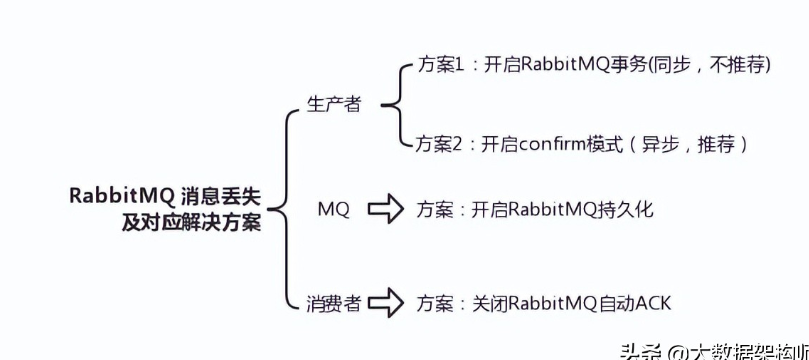

### 8 rabbitmq如何避免消息堆积?

1.去优化消费者代码，提高消费能力。减少消费时间
2.可以给消费设置年龄（生命周期），如果超时就丢弃掉。可以不让消息大量堆积在消息队列中
3.可以设置队列的最大长度：如果超过了，就无法接收消息到队列中。
4.建立新的消息队列，采用订阅模式，消费者同时去订阅新的，还有旧的消息队列，同时去消费消息。

### 9 rabbitmq如何防止消息重复消费?

​	每个消息用一个唯一标识来区分，消费前先判断标识有没有被消费过，若已消费过，则直接ACK

### 10 rabbitmq如何保证高可用

镜像集群模式

### 11 RabbitMQ运作模式

``执行运作前先绑定（Binding），就是一套规则，为整体的操作做前置准备``

看图前先介绍一下各方代表：

- Publisher：生产者
- Consumer：消费者
- Virtual host：本质为一个RabbitMQ服务器
  - Exchange：交换器。相当于服务器中的组件，用于操作数据
  - Queue：队列。存储运送的信息

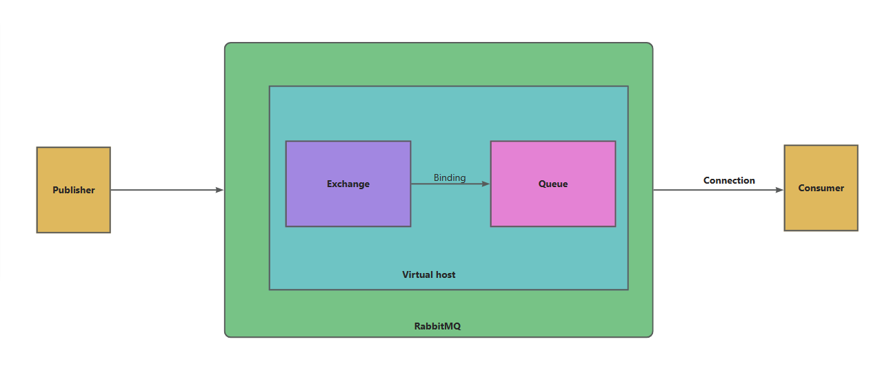

## 二、MQ问题解决

### 1 RabbitMQ的五种运行模式（快速开始）

每种模式取决于不同的需求，根据需求来决定自己使用哪种运行模式。

> 前置依赖

```xml
		<!--AMQP依赖，包含RabbitMQ-->
        <dependency>
            <groupId>org.springframework.boot</groupId>
            <artifactId>spring-boot-starter-amqp</artifactId>
        </dependency>
```

> yml文件链接配置

```yml
spring:
  rabbitmq:
    host: 192.168.138.100	# 你的虚拟机IP
    port: 5672	# 端口
    virtual-host: /hmall	# 虚拟主机，别人提供或者提前创建
    username: dwx	# 用户名
    password: 123	# 密码
```

> config1.交换机Exchange、队列Queue、绑定Binding配置

``交换机配置``

```java
	//创建一个名为fanout.Exchange的交换机
	@Bean
    public FanoutExchange fanoutExchange(){
        return new FanoutExchange("fanout.Exchange");
    }
```

``队列配置``

```java
	//创建方式1
	@Bean
    public Queue fanoutQueue1(){
        return new Queue("fanout.Queue1");
    }

	//创建方式2
    @Bean
    public Queue fanoutQueue2(){
        return QueueBuilder.durable("fanout.Queue2").build();
    }
```

``绑定配置``

```java
	//将fanout.Queue1绑定到fanout.Exchange
	@Bean
    public Binding fanoutBinding1(){
        return BindingBuilder.bind(fanoutQueue1()).to(fanoutExchange());
    }
```

> config2.注解配置交换机Exchange、队列Queue、绑定Binding

```java
    //用在监听方法上，直接创建交换机并绑定队列
    @RabbitListener(bindings = {
            @QueueBinding(
                    value = @Queue(name = "fanout.Queue2"),
                    exchange = @Exchange(name = "fanout.Exchange",
                                         type = ExchangeTypes.FANOUT),
                                         key = "***"
            )
    })
```

> 操作工具类

1.SpringAMQP自身也封装`AmqpTemplate`工具

2.RabbitMQ封装了`RabbitTemplate`工具

都可以用于发送消息，操作前注入该工具类,代码交互发送用`convertAndSend（）`方法，不同参数代表不同含义

> 接受不同的数据类型，完成后可以直接发送各种类型数据

``导入依赖转换工具包``

```xml
		<dependency>
            <groupId>com.fasterxml.jackson.dataformat</groupId>
            <artifactId>jackson-dataformat-xml</artifactId>
            <version>2.9.10</version>
        </dependency>
```

``配置类``

```java
public class MessageConverterConfig {
    @Bean
    public MessageConverter messageConverter() {
        return new Jackson2JsonMessageConverter();
    }
}
```

#### 1.1 简单模式（Simple）：一个生产者，一个消费者

最简单的消息模式，一个生产者，一个消费者和一个队列，生产者向队列里发送消息，消息者从队列中获取消息并消费。如图：

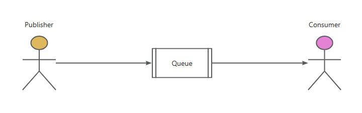

``生产者``

```java
	@Test
    public void testFanoutQueue() {
        String queueName = "fanout.Queue1";
        rabbitTemplate.convertAndSend
            (queueName,User.builder().name("dwx").age(25).id(1).build());
    }
```

``消费者``

```java
	@RabbitListener(queues = "fanout.Queue1")
    public void listenSimpleQueueMessage2(Object msg) {
        System.out.println(msg);
    }
```

#### 1.2 工作队列模式（Work Queue）： 多个消费者竞争消息

与简单模式相比，工作模式多了一些消费者。该模式采用**DirectExchange**，多用与处理消息较多的情况。

如图：

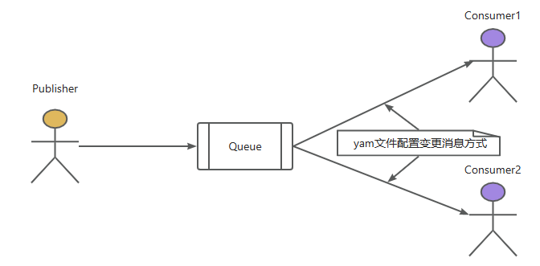

- #### **特点**

  1.一个队列对应多个消费者

  2.每条消息只能被一个消费者消费

  3.消息队列默认采用轮询的方式将消息平均发送给消费者

因为工作队列**默认采用轮询方式**发送消息，这时工作队列模式就有了一个问题，实际业务场景中我们不可能确保每个接口响应都是一致的，有的接口快有的接口慢，就会出现快的消费者等待慢的消费者消费消息的情况，造成了资源浪费。为了解决这个问题，就使用配置文件改变工作队列默认的发送消息方式，如下：

```yml
spring:
  rabbitmq:
    listener:
      simple:
        prefetch: 1 #每次拉取一条，消费完成后，立刻再拉取一条
```

改变完成后，消费者之间就变成了一种**竞争关系**。当快的消费者消费完成后，不会等待慢的消费者，而是立刻再次拉取一条消息。这样，资源浪费问题就完美解决了。

> 代码方面比之简单模式多创建方法绑定了队列而已

#### 1.3 发布/订阅模式（Publish/Subscribe）：一个生产者，多个消费者

这个模式是为每一个消费者都创建了一个**独属于自己的队列**，从而达到让一条消息让所有消费者都接受到。在开发过程中，有一些消息需要不同消费者进行不同的处理。

如图：

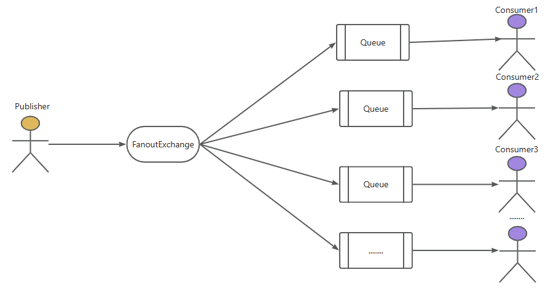

- #### 特点

  1.生产者将消息发送给交换机，交换机将消息转发到绑定此交换机的**每个队列**中。

  2.**发布订阅模式的交换机能将消息发送给多个队列**。发布订阅模式使用FanoutExchange交换机。

> 交换机为fanout类型，无条件群发

``生产者``

```java
	/**
     * 发布订阅模式
     * @throws Exception
     */
    @Test
    public void fanoutTest() throws Exception {
        String fanoutExchange = "fanout.exchange";
        String message = "Hello, FanoutMessage";
        //参数一：交换机
        //参数二：路由Key
        //参数三：消息
        rabbitTemplate.convertAndSend(fanoutExchange, "", message);
    }
```

``消费者``

消费者代码同简单模式一样

#### 1.4 路由模式（Routing）：根据路由键将消息转发到对应队列

使用发布订阅模式时，所有消息都会发送到绑定的队列中，但很多时候，不是所有消息都无差别的发布到所有队列中，该模式比之发布订阅模式多了一个指定的routingKey，这个用来辨别发送给哪一个队列。

如图：

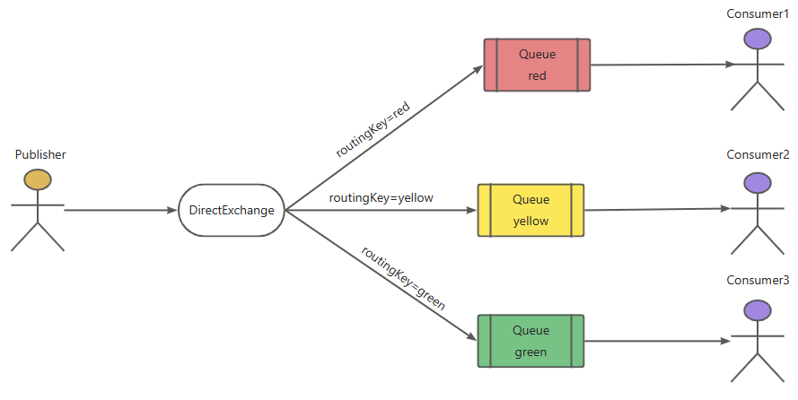

- #### 特点

  1.每个队列绑定路由关键字**RoutingKey**

  2.生产者将带有RoutingKey的消息发送给交换机，交换机**根据RoutingKey**转发到指定队列。路由模式使用**DirectExchange**交换机。

> 交换机为direct类型，根据重载的方法来实现绑定routingKey

``生产者``

```java
	@Test
    public void testDirectQueue() {
        String exchangeName = "direct.Queue1";
        rabbitTemplate.convertAndSend(exchangeName,"red","red message");
        rabbitTemplate.convertAndSend(exchangeName,"yellow","red message");
        rabbitTemplate.convertAndSend(exchangeName,"green","red message");
    }
```

``消费者``

消费者代码同简单模式一样

#### 1.5 通配符模式（Topics）：使用通配符匹配路由键

这个和路由模式大同小异，就是一个routingKey更为灵活了，可以用通配符`*`来表示任意字符串，中间用`.`来隔开

如图：

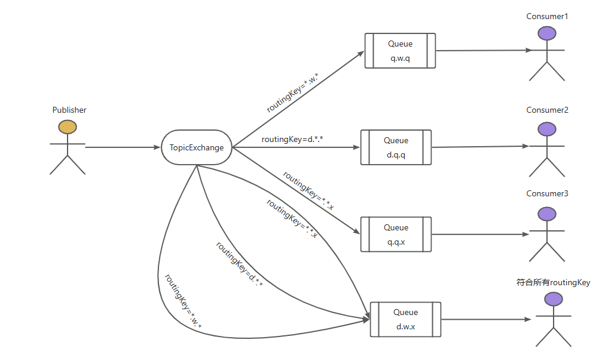

- ### 通配符规则

  1.消息设置RoutingKey时，RoutingKey由多个单词构成，中间以`.`分割。

  2.队列设置RoutingKey时，`#`可以匹配任意多个单词，`*`可以匹配任意一个单词。

> 交换机为topic类型,比之路由模式更加灵活

``生产者``

```java
	@Test
    public void testDirectQueue() {
        String exchangeName = "direct.Queue1";
        rabbitTemplate.convertAndSend(exchangeName,"q.w.q","red message");
        rabbitTemplate.convertAndSend(exchangeName,"d.q.q","red message");
        rabbitTemplate.convertAndSend(exchangeName,"q.q.x","red message");
        rabbitTemplate.convertAndSend(exchangeName,"d.w.x","red message");
    }
```

``消费者``

消费者代码同简单模式一样

### 2 MQ如何保证顺序消费

RabbitMQ的queue本身就是队列，是可以保证消息的顺序投递的。

但是消息的顺序消费则是另一回事了，所谓的“顺序消费”意味着是否顺序达到目的地，比如：数据库。

看看以下场景：

一个 queue，多个 consumer。比如，生产者向 RabbitMQ 里发送了三条数据，顺序依次是 data1/data2/data3，压入的是 RabbitMQ 的一个内存队列。有三个消费者分别从 MQ 中消费这三条数据中的一条，结果消费者2先执行完操作，把 data2 存入数据库，然后是 data1/data3。这不明显乱了。

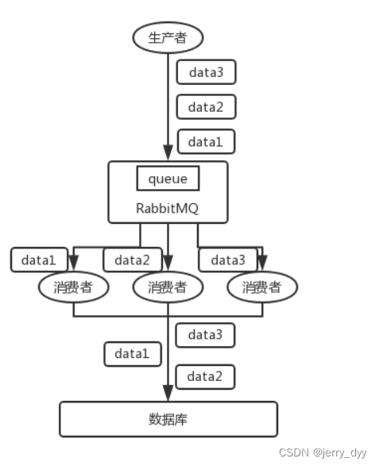

产生多个consumer去消费一个queue，极有可能是因为：消息消费太慢，所以盲目让多个consumer同时来消费，而忽略了消息消费顺序性。

在某些情况下，消息是需要保证顺序性的，如果上图中的data1, data2, data3 分别意味着对某条数据的增改删，但是如果乱序以后就变成了：删改增。

**解决方案**：

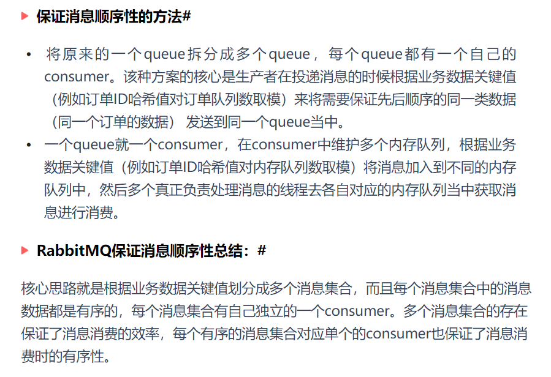

### 3 MQ如何消息不丢失，持久化

有四种方式可以解决：

1. 消息持久化
2. ACK确认机制（项目中使用）：ACK确认机制是消费者从队列中收到消息，进行业务逻辑的处理，在这一过程中如果消费者出现服务器异常、网络不稳定等，都不会有ACK应答，这时候RabbitMQ就认为这条消息没有正常消费成功，就会将消息重新放回队列中。直到消费者发送ACK应答，这条消息才会从队列中消费掉。**使用**：需要手动开启配置，yaml文件

publisher-confirm-type: correlated  # 开启确认机制回调 必须配置这个才会确认回调

​       publisher-returns: true # 开启return机制回调


1. 设置集群镜像模式
2. 消息补偿机制

**消息持久化解决**：

消息中心收到生产者的消息后，先将消息存储在本地数据文件，内存数据库或者远程数据库，再试图把消息发送给消费者，发送成功则讲消息从存储中删除，如失败则继续尝试发送
消息中心启动时，先会检查指定的存储位置，如有未成功发送的消息，则会把消息发送出去

1. Exchange 设置持久化：基于代码的，参数设为true
2. Queue 设置持久化
3. Message持久化发送：发送消息设置发送模式deliveryMode=2，代表持久化消息


### 4 MQ的消息确认机制（生产者发送到交换机，有个回调，交换机到队列，也有个回调，消费者有没有去消费这个消息）

1. 为了保证消息从队列可靠的达到消费者，RabbitMQ 提供了消息确认机制（Message Acknowledgement）。消费者在订阅队列时，可以指定 autoAck 参数，当 autoAck 参数等于 false 时，RabbitMQ 会等待消费者显式地回复确认信号后才从内存（或者磁盘）中移除消息（实际上是先打上删除标记，之后在删除）。当 autoAck 参数等于 true 时，RabbitMQ 会自动把发送出去的消息置为确认，然后从内存（或者磁盘）中删除，而不管消费者是否真正地消费到了这些消息。
2. 采用消息确认机制后，只要设置 autoAck 参数为 false，消费者就有足够的时间处理消息（任务），不用担心处理消息过程中消费者进程挂掉后消息丢失的问题，因为 RabbitMQ 会一直等待持有消息直到消费者显式调用 Basic.Ack 命令为止。
3. 当autoAck 参数为 false 时，对于 RabbitMQ 服务器端而言，队列中的消息分成了两部分：一部分是等待投递给消费者的消息；一部分是已经投递给消费者，但是还没有收到消费者确认信号的消息。如果 RabbitMQ 服务器端一直没有收到消费者的确认信号，并且消费此消息的消费者已经断开连接，则服务器端会安排该消息重新进入队列，等待投递给下一个消费者（也可能还是原来的那个消费者）。
4. RabbitMQ 不会为未确认的消息设置过期时间，它判断此消息是否需要重新投递给消费者的唯一依据是消费该消息连接是否已经断开，这个设置的原因是 RabbitMQ 允许消费者消费一条消息的时间可以很久很久。


### 5 MQ高可用

**镜像集群模式**：

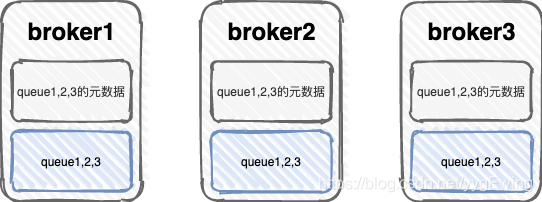

1. 无论元数据还是 queue 里的消息都会存在于多个broker上
2. 每个queue都想拥有多个镜像放在其他broker上，可以选择镜像队列的数量
3. 由于每个broker上都具有近乎完整的数据，所以消费者消费的时候并不需要进行消息传输，但由于并不是想Kafka分布式消息队列那样的分片存储，所以性能并不高


小小总结一下，RabbitMQ其实并不是分布式消息队列，大厂使用的分布式消息队列，更多是RocketMQ或者Kafka，可以分布式分片存储，水平扩容性能会有明显提升


### 6 消息生产方将消息成功投递到消息消费方，消息消费成功了， 业务逻辑执行失败了， 问怎么办？ 

 自动确认机制 改成 手动确认，在业务逻辑 try...catch{} 拒绝接收，消息重放到MQ队列

### 7 MQ消息堆积问题

 多线程消息 + 一个线程一次去消费多少条消息

### 8 如何保证幂等性

- 消费数据为了单纯的写入数据库，可以先根据主键查询数据是否已经存在，如果已经存在了就没必要插入了。或者直接插入也没问题，因为可以利用主键的唯一性来保证数据不会重复插入，重复插入只会报错，但不会出现脏数据。
- 消费数据只是为了缓存到redis当中，这种情况就是直接往redis中set value了，天然的幂等性。
- 针对复杂的业务情况，可以在生产消息的时候给每个消息加一个全局唯一ID，消费者消费消息时根据这个ID去redis当中查询之前是否消费过。如果没有消费过，就进行消费并将这个消息的ID写入到redis当中。如果已经消费过了，就无需再次消费了。key：全局唯一  redis：key

### 9 消费者已经接收了消息，因为某种原因导致业务代码没执行完全，怎么处理？

1. **失败重试机制，配置**

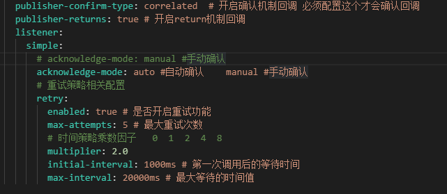

1. **策略**

