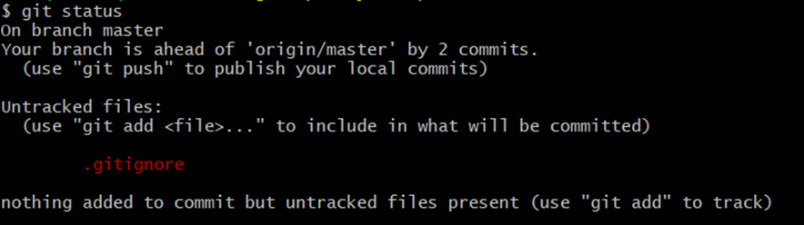

# 代码管理工具-Git

## 一、 前言

### 1 什么是Git

Git是一个分布式版本控制工具，主要用于管理开发过程中的源代码文件（Java类、xml文件、html页面等），在软件开发过程中被广泛使用。

在IDEA开发工具中可以集成Git（后面会讲解Git安装和集成过程）：


集成后在IDEA中可以看到Git相关图标：


可以通过启动两个IDEA窗口模拟两个开发人员来展示Git的使用：


其他的版本控制工具：

- SVN
- CVS
- VSS

### 2 使用Git能做什么

- 代码回溯：Git在管理文件过程中会记录日志，方便回退到历史版本
- 版本切换：Git存在分支的概念，一个项目可以有多个分支（版本），可以任意切换
- 多人协作：Git支持多人协作，即一个团队共同开发一个项目，每个团队成员负责一部分代码，通过Git就可以管理和协调
- 远程备份：Git通过仓库管理文件，在Git中存在远程仓库，如果本地文件丢失还可以从远程仓库获取

## 二、Git概述

### 1 Git简介

Git 是一个分布式版本控制工具，通常用来对软件开发过程中的源代码文件进行管理。通过Git 仓库来存储和管理这些文件，Git 仓库分为两种：

- 本地仓库：开发人员自己电脑上的 Git 仓库
- 远程仓库：远程服务器上的 Git 仓库


解释说明：

> commit：提交,将本地文件和版本信息保存到本地仓库
>
> push：推送,将本地仓库文件和版本信息上传到远程仓库
>
> pull：拉取,将远程仓库文件和版本信息下载到本地仓库


1、怎么创建本地仓库？本地仓库是什么？

2、怎么创建远程仓库？远程仓库时什么？

3、commit 什么东西？

4、push 干什么的？

5、pull 什么效果？


### 2 Git下载与安装

下载地址： https://git-scm.com/download


下载完成后得到安装文件：

直接双击完成安装即可，安装完成后可以在任意目录下点击鼠标右键，如果能够看到如下菜单则说明安装成功：


Git GUI Here：打开Git 图形界面


Git Bash Here：打开Git 命令行


Git安装目录结构如下：


## 三、Git常用命令

### 1 Git全局设置

当安装Git后首先要做的事情是设置用户名称和email地址。这是非常重要的，因为每次Git提交都会使用该用户信息。在Git 命令行中执行下面命令：

**设置用户信息** 

  git config --global user.name "dwx"

  git config --global user.email "927055595@qq.com"

**查看配置信息**

  git config --list

注意：上面设置的user.name和user.email并不是我们在注册码云账号时使用的用户名和邮箱，此处可以任意设置。


### 2 获取Git仓库

要使用Git对我们的代码进行管理，首先需要获得Git仓库。

获取Git仓库通常有两种方式：

- 在本地初始化Git仓库
- 从远程仓库克隆（常用）

#### 2.1 在本地初始化Git仓库

**操作步骤如下**：

1. 在任意目录下创建一个空目录（例如repo1）作为我们的本地Git仓库
2. 进入这个目录中，点击右键打开Git bash窗口
3. 执行命令**git** **init**

如果在当前目录中看到.git文件夹（此文件夹为隐藏文件夹）则说明Git仓库创建成功


#### 2.2 从远程仓库克隆

可以通过Git提供的命令从远程仓库进行克隆，将远程仓库克隆到本地

**命令格式**：git clone 远程仓库地址


### 3 工作区、暂存区、版本库

为了更好的学习Git，我们需要了解Git相关的一些概念，这些概念在后面的学习中会经常提到。

**版本库**：前面看到的.git隐藏文件夹就是版本库，版本库中存储了很多配置信息、日志信息和文件版本信息等

**工作区**：包含.git文件夹的目录就是工作区，也称为工作目录，主要用于存放开发的代码

**暂存区**：.git文件夹中有很多文件，其中有一个index文件就是暂存区，也可以叫做stage。暂存区是一个临时保存修改文件的地方


### 4 Git工作区中文件的状态

Git工作区中的文件存在两种状态：

- untracked 未跟踪（未被纳入版本控制）

- tracked 已跟踪（被纳入版本控制）

  ​     1）Unmodified 未修改状态

  ​     2）Modified 已修改状态

  ​     3）Staged 已暂存状态


**注意**：文件的状态会随着我们执行Git的命令发生变化


### 5 本地仓库操作

本地仓库常用命令如下：

- git status 查看文件状态
- git add 将文件的修改加入暂存区
- git reset 将暂存区的文件取消暂存或者是切换到指定版本
- git commit 将暂存区的文件修改提交到版本库
- git log  查看日志

#### 5.1 git status

git status 命令用于查看文件状态




注意：由于工作区中文件状态的不同，执行 git status 命令后的输出也会不同

#### 5.2 git add

git add 命令的作用是将文件的修改加入暂存区，命令格式：git add fileName


加入暂存区后再执行 git status 命令，可以发现文件的状态已经发生变化。

#### 5.3 git reset

git reset 命令的作用是将暂存区的文件**取消暂存**或者是**切换到指定版本**

取消暂存命令格式：git reset 文件名


切换到指定版本命令格式：git reset --hard 版本号


注意：每次Git提交都会产生新的版本号，通过版本号就可以回到历史版本


#### 5.4 git commit

git commit 命令的作用是将暂存区的文件修改提交到版本库，命令格式：git commit -m msg 文件名


解释说明：

> -m：代表message，每次提交时需要设置，会记录到日志中
>
> 可以使用通配符*一次提交多个文件


#### 5.5 git log

git log 命令的作用是查看提交日志


通过git log命令查看日志，可以发现每次提交都会产生一个版本号，提交时设置的message、提交人、邮箱、提交时间等信息都会记录到日志中


### 6 远程仓库操作

前面执行的命令操作都是针对的本地仓库，本节我们会学习关于远程仓库的一些操作，具体包括：

- git remote  查看远程仓库
- git remote add 添加远程仓库
- git clone 从远程仓库克隆
- git pull 从远程仓库拉取
- git push 推送到远程仓库


```tex


如果本地仓库是从远程仓库直接克隆的也就是通过 git clone  方式创建本地仓库，此时远程仓库和本地仓库本省建立了联系

git remote  查看远程仓库信息

git push  推送本地仓库内容 到 远程仓库

git pull  从远程仓库更新代码


如果 本地仓库是通过 git init 方式 此时 本地仓库和远程仓库没有关系

git remote  add  远程分支名  远程仓库地址   （建立本地仓库和远程仓库关系）

git remote  查看远程仓库信息

git push  推送本地仓库内容 到 远程仓库

git pull  从远程仓库更新代码


```


#### 6.1 git remote

如果要查看已经配置的远程仓库服务器，可以执行 git remote 命令，它会列出每一个远程服务器的简称。

如果已经克隆了远程仓库，那么至少应该能看到 origin ，这是 Git 克隆的仓库服务器的默认名字。


解释说明：

> 可以通过-v参数查看远程仓库更加详细的信息
>
> 本地仓库配置的远程仓库都需要一个简称，后续在和远程仓库交互时会使用到这个简称


#### 6.2 git remote add

添加远程仓库命令格式：git remote add 远程名 远程仓库地址


注意：一个本地仓库可以关联多个远程仓库

#### 6.4 git push

将本地仓库内容推送到远程仓库，命令格式：git push 远程仓库简称 分支名称


在使用git push命令将本地文件推送至码云远程仓库时，如果是第一次操作，需要进行身份认证，认证通过才可以推送，如下：


注意：上面的用户名和密码对应的就是我们在码云上注册的用户名和密码，认证通过后会将用户名和密码保存到windows系统中（如下图），后续再推送则无需重复输入用户名和密码。


推送完成后可以到远程仓库中查看文件的变化。

解释说明：

> 一个仓库可以有多个分支，默认情况下在创建仓库后会自动创建一个master分支
>


#### 6.5 git pull

**git** **pull** 命令的作用是从远程仓库获取最新版本并合并到本地仓库

命令格式：git pull 远程仓库简称 分支名称


**注意**：如果当前本地仓库不是从远程仓库克隆，而是本地创建的仓库，并且仓库中存在文件，此时再从远程仓库拉取文件的时候会报错（fatal: refusing to merge unrelated histories ）

解决此问题可以在git pull命令后加入参数--allow-unrelated-histories

### 7 分支操作

分支是Git 使用过程中非常重要的概念。使用分支意味着你可以把你的工作从开发主线上分离开来，以免影响开发主线。

本地仓库和远程仓库中都有分支，同一个仓库可以有多个分支，各个分支相互独立，互不干扰。

通过git init 命令创建本地仓库时默认会创建一个master分支。


本节我们会学习关于分支的相关命令，具体命令如下：

- git branch                                     查看分支
- git branch [name]                       创建分支
- git checkout [name]                    切换分支
- git push [shortName] [name]   推送至远程仓库分支
- git merge [name]                        合并分支

#### 7.1 查看分支

查看分支命令：git branch

git branch 		列出所有本地分支

git branch -r 	列出所有远程分支

git branch -a 	列出所有本地分支和远程分支


#### 7.2 创建分支

创建分支命令格式：git branch 分支名称


#### 7.3 切换分支

一个仓库中可以有多个分支，切换分支命令格式：git checkout 分支名称


注意：在命令行中会显示出当前所在分支，如上图所示。

#### 7.4 推送至远程仓库分支

推送至远程仓库分支命令格式：git push 远程仓库简称 分支命令


推送完成后可以在网站查看远程仓库

#### 7.5 合并分支

合并分支就是将两个分支的文件进行合并处理，命令格式：git merge 分支命令


注意：分支合并时需注意合并的方向，如上图所示，在Master分支执行操作，结果就是将b3分支合并到Master分支。

