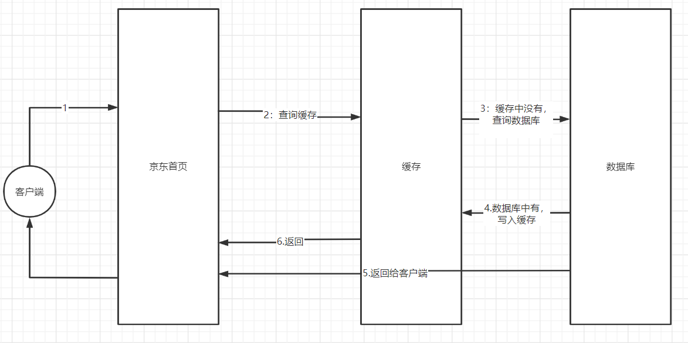
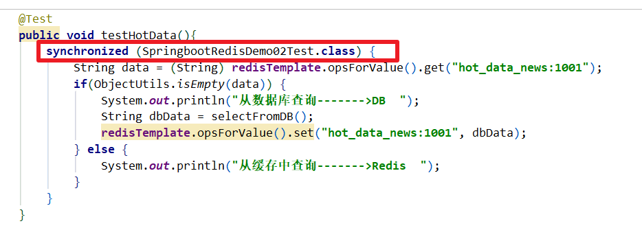
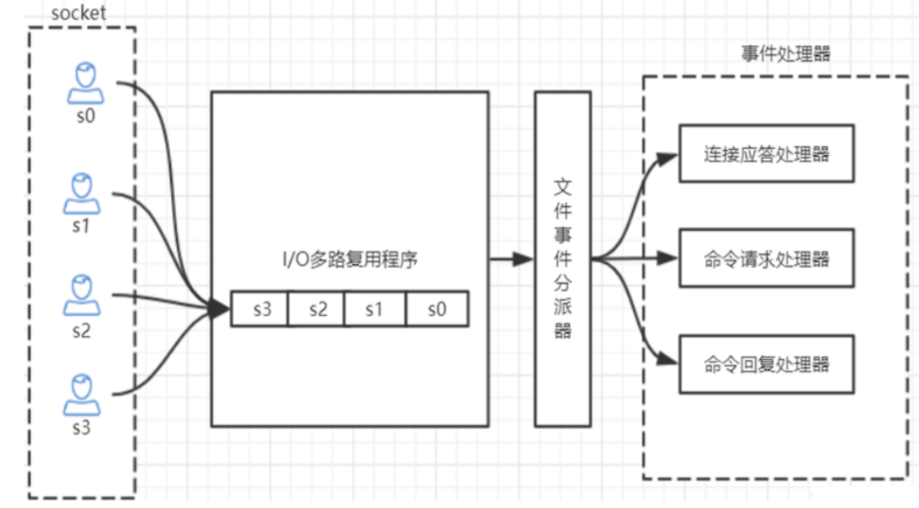

# 数据缓存技术-Redis

## 一、现有项目的缺陷

### 1 数据缓存

| 餐馆王App搞抢购活动                                         |
| ----------------------------------------------------------- |
|  |

| Redis来实现数据的缓存                                        |
| ------------------------------------------------------------ |
|  |


### 2 分布式Session

| 原始登录方式                                                 |
| ------------------------------------------------------------ |
|  |

| Redis实现分布式Session                                       |
| ------------------------------------------------------------ |
|  |


## 二、Redis介绍与安装

### 1 概述

- 是一个由C语言开发的基于key-value形式的非关系型数据库
  - key-value：键值对【键：String，值：五种数据类型】
    - 非关系数据库：NoSQL【Not Only SQL】
      - 关系型数据库：由二维表的形式来存储数据
      - 不是关系型数据库，就是非关系型数据库
- 存储介质
  - 默认是内存
  - 可以持久化到磁盘上

- 官网
  - 中文：http://www.redis.cn/
  - 英文：https://redis.io/

### 2 安装

#### 2.1 基于tar.gz安装

> - 下载地址：https://redis.io/download/

```shell
#安装gcc环境和make指令
apt-get install gcc
apt-get install make

#下载
wget http://download.redis.io/releases/redis-5.0.8.tar.gz

#解压
tar -zxvf redis-5.0.8.tar.gz -C /usr/local/

#make
cd /usr/local/redis-5.0.8
make

#运行
cd src
./redis-server
```

| 前台运行【./redis-server】                                   |
| ------------------------------------------------------------ |
| image-20220406145952907 |

| redis客户端测试【./redis-cli】                         |
| ------------------------------------------------------ |
|  |


#### 2.2 基于Docker安装

> 安装成功后，会自动在后台启动redis的服务端

- 准备工作

```shell
mkdir -p /opt/redis
cd /opt/redis
```

- docker-compose.yml

```yml
version: '3.7'
services:
  redis:
    image: daocloud.io/library/redis:5.0.8
    restart: always
    container_name: redis
    environment:
      - TZ=Asia/Shanghai
    ports:
      - 6379:6379
```

- 启动容器

```shell
docker-compose up -d
```

- 测试

| 测试                                                         |
| ------------------------------------------------------------ |
|  |


## 三、Redis的客户端工具

### 1 命令行客户端

```shell
#默认情况下，连接的是本地的redis，且端口号是默认的6379
redis-cli

#完整语法
#redis-cli -h redis服务器的IP -p redis的端口
redis-cli -h 192.168.145.128 -p 6379
```

### 2 图形化客户端【windows版本】

- RedisDesktopManager【安装：一路默认下一步即可】

| RedisDesktopManager                                          |
| ------------------------------------------------------------ |
|  |
|  |

### 3 Java客户端

- Jedis：Redis官方提供的一个Java操作Redis的API
- RedisTemplate：SpringBoot集成Redis提供的API


## 四、Redis的五种数据类型

> 这里的数据类型指的是值的数据类型

### 1 五种数据类型

> - string：字符串
> - hash：对象
> - list：有序列表
> - set：无序集合
> - zset：有序集合

| 五种数据类型                                                 |
| ------------------------------------------------------------ |
|  |

### 2 string

```shell
#设置值
#set key value
set name lucy
#结果，正确就返回OK

#获取值
#get key
get name
#结果，有就返回值，没有nil[null]

#返回key对应的value，再重新设置这个key的值
#getset key value
getset name lily

#设置多个键值对
#mset k1 v1 k2 v2 ...
mset sex 1 age 20 address hangzhou
#结果：OK

#获取多对key对应的value
#mget k1 k2 k3 ...
mget sex age address
#结果：依次返回得到数据

#设置key-value:如果key不存在，则设置，如果key存在，则什么都不做
#setnx key value
#结果：成功返回1，失败返回0
setnx phone 13577889900

#计算key对应的value的长度
#strlen key
strlen phone
#结果为11，phone存的值是11位

#在原先的基础之上进行字符串追加
#append key value
append address xiaoshan
#本来address的值是hangzhou，现在就是hangzhouxiaoshan

#自增1,value是数值类型才能成功。如果key不存在，则直接以0为基础，进行自增。如果这个值不是数值，则会报错
#incr key
incr age
#age本来是20，现在返回就是21

#自增指定数量,value是数值类型才能成功
incrby age 5
#age本来是20，现在返回就是25

#自减1，value是数值类型才能成功。
#decr key
decr age
#age本来是0，现在返回就是-1

#自减指定数量,value是数值类型才能成功
#decrby key
decrby age 20
#age本来是30，现在返回就是10
```

| string操作                                                   |
| ------------------------------------------------------------ |
|  |
|  |
|  |

### 3 hash

```shell
#设置值，必须指定大key和小key
hset person name lisi

#设置多值
hmset person sex 1 age 20

#获取单个小key对应的value
hget person sex

#获取多个小key对应的value们
hmget person name age

#获取所有的小key
hkeys person

#获取所有的小key对应的values
hvals person

#获取所有大key中的键值对
hgetall person

#判断小key是否存在
hexists person age

#求大key中小key的数量
hlen person

#设置小key【小key不存在，则设置成功，如果存在，则什么都不做】
hsetnx person age 25
```

| hash操作                                                     |
| ------------------------------------------------------------ |
|  |
|  |


### 4 list

> 在操作list时
>
> - 向list中增加数据【有两种方式，推荐使用右压栈】
>   - 左边增加数据【左压栈，后增加的数据会把之前增加的数据向右挤】，在读取时是反向的
>   - 右边增加数据【右压栈，后增加的数据会把之前增加的数据向左挤】，在读取时是正向的
> - 从list中获取数据
>   - 获取的数据是从左到右的

```shell
#左压栈
lpush key v1 v2 ...
#特征:存入的数据顺序跟读取顺序相反

#右压栈
rpush key v1 v2 ...
#特征:存入的数据顺序跟读取顺序相同

#查询列表中的数据
#下标从0开始，如果要读到最末尾，endIndex就是-1
#lrange key startIndex endIndex
lrange key 0 -1

#获取列表元素的个数
llen key

#获取指定索引的元素,index表示索引
lindex key index
#获取指定索引为3的元素
#lindex key 3

#从左边弹出一个元素[获取最左边的元素，再删除它]
lpop key

#从右边弹出一个元素
rpop key

#从一个列表的右边弹出元素，再追到加另一个列表的左边
rpoplpush 源列表 目标列表

#移除count个的value值
lrem key count value
lrem names 2 tom
#删除names列表中2个tom【是从左开始移除】
```

| list操作                                                     |
| ------------------------------------------------------------ |
|  |
|  |
|  |


### 5 set

```shell
#存值
sadd myset aa bb cc
#返回存入的个数

#获取集合长度
scard myset

#获取集合元素
smembers myset

#判断元素是否在集合中。存在:返回1，不存在:返回0
sismember myset cc

#删除
srem myset cc

#随机弹出一个元素
spop myset

#随机弹出指定个数元素
spop myset 2

#差集
sdiff myset1 myset2

#交集
sinter myset1 myset2

#并集
sunion myset1 myset2

#将交集结果存入到另一个集合中
#sdiffstore 存储结果的集合名 操作的集合一 操作的集合二
sdiffstore myset3 myset1 myset2

#将交集结果存入到另一个集合中
sinterstore myset4 myset1 myset2

#将并集结果存入到另一个集合中
sunionstore myset5 myset1 myset2

#将myset1中的aa元素移动到myset3
smove myset1 myset3 aa
```

| set相关操作                                                  |
| ------------------------------------------------------------ |
|  |
|  |
|  |


### 6 zset

```shell
#向有序集合中增加元素
#zadd 集合名 分数1 名称1 分数2 名称2 ...
zadd tuhaobang 10 liubei 80 caocao 30 sunquan
#返回插入的数量

#获取集合中元素的数量
zcard tuhaobang

#获取集合中指定区间的元素名称，如果后面的索引是-1，则返回所有元素名称
zrange tuhaobang 0 -1
1) "liubei"
2) "sunquan"
3) "caocao"

#获取集合所有的元素，包括名称和分数【是从小到大排序】
zrange tuhaobang 0 -1 withscores
1) "liubei"
2) "10"
3) "sunquan"
4) "30"
5) "caocao"
6) "80"

#获取集合前两位元素的名称和分数
zrange tuhaobang 0 1 withscores
1) "liubei"
2) "10"
3) "sunquan"
4) "30"

#为集合中指定的名称的元素增加分数
zincrby tuhaobang 50 liubei
#返回增加后的分数

#返回集合中指定名称的分数
zscore tuhaobang sunquan

#把myzset1和myzset2根据元素名称求出交集，并把相同名称的value加在一起，得到元素名称的新分数，存入到新集合中，成功返回的是交集的个数
#zinterstore 目标集合 操作集合的数量 集合一 集合二 ...
ZINTERSTORE myzset3 2 myzset1 myzset2

#zrangebyscore 集合名称 小分数 大分数 [withscores] [limit 第几条开始显示 显示数量]
#在不知道当前集合中最大值和最小值的情况下，-inf代表最小值   +inf代表最大值
#获取tuhaobang集合中所有元素名称及分数
zrangebyscore tuhaobang -inf +inf withscores
#获取tuhaobang集合中第一个元素名称及分数
zrangebyscore tuhaobang -inf +inf withscores limit 0 1
#获取tuhaobang集合中分数在50-100之间的所有元素名称及分数
zrangebyscore tuhaobang 50 100 withscores
#获取tuhaobang集合中分数在50-100之间的前两位元素名称及分数
zrangebyscore tuhaobang 50 100 withscores limit 0 2

#按从大到小的顺序进行排序，并获取前2位
zrevrangebyscore tuhaobang +inf -inf withscores limit 0 2

#根据元素名删除元素
zrem key member [member...]

#获取集合中指定元素名称对应的索引
zrank tuhaobang caocao

#删除指定分数区间的元素[10,20]，删除成功返回删除的个数，否则返回0
ZREMRANGEBYSCORE tuhaobang 10 20
```

| zset操作                                                     |
| ------------------------------------------------------------ |
|  |
|  |


### 7 通用命令

- 跟key相关的

```shell
#查找匹配规则的key, *:代表0到多个字符，?代表一个字符
keys *
keys ?a*

#判断key是否存在，存在:返回1，不存在:返回0
exists key

#删除key，删除成功返回1，删除不存在的key返回0
del key

#查看key剩余有效时间
#ttl key
ttl gender
结果:返回剩余有效时间，如果已经过期：返回-2，如果没有设置有效时间：返回-1

#设置已经存在的key的过期时间，单位为秒
expire key seconds

#为已经存在的key设置过期时间，单位是毫秒
pexpire key 毫秒
#查看指定key的剩余存活时间，单位是毫秒
pttl key

#移除指定key的生存时间，永久的持久化
persist key

#获取指定的key的value的数据类型
type key

#移动当前数据库中对应的key到其他数据库,dbindex是0-15
move key dbindex
```

| key相关的操作                                                |
| ------------------------------------------------------------ |
|  |
|  |
|  |

- 跟数据库相关的

```shell
#redis默认有16个数据库，分别是 db0 - db15
#查看当前数据库下有多少key
dbsize

#切换数据库,dbindex是0-15
select dbindex

#清空当前数据库，慎重
flushdb

#清空所有数据库中的数据，慎重
flushall

#实时监控Redis服务接收到的命令【其他客户端的操作，能够被监控到】
monitor
```

| 数据库相关的                                                 |
| ------------------------------------------------------------ |
|  |


### 8 查看redis性能的命令

```shell
#redis写的性能
redis-benchmark set

#redis读的性能
redis-benchmark get
```

| 写跟性的性能                                                 |
| ------------------------------------------------------------ |
|  |


## 五、Redis核心配置文件

> 在基于tar.gz的安装方式下，redis的配置文件`redis/redis.conf`
>
> redis所有相关配置信息都在这个配置文件中，其中很优秀的设计都可以从其中看到

### 1 带着配置去运行Redis的服务

```shell
./redis-server ../redis.conf
```

#### 1.1 修改redis的配置文件

> 1. 允许远程连接
> 2. 允许守护线程运行
> 3. 关闭保护模式
> 4. 设置密码

```shell
#关闭本地绑定【69行】
#bind 127.0.0.1

#关闭保护模式【88行】
把 protected-mode yes 改成 protected-mode no

#开启守护线程模式【136】
daemonize yes

#设置密码【507行】
requirepass ghyredis
```

| ./redis-server ../redis.conf                                |
| ----------------------------------------------------------- |
|  |

#### 1.2 通过命令行客户端工具操作redis

> 需要输入密码后，才能正常操作

| 需要输入密码                                                 |
| ------------------------------------------------------------ |
|  |

#### 1.3 远程客户端工具

| RedisDesktopManager                                          |
| ------------------------------------------------------------ |
|  |

#### 1.4 将来使用Java操作Redis时也需要密码


## 六、Jedis

### 1 概述

- 是Redis官方提供一款Java操作Redis的API
- Jedis方法就是Redis的命令

### 2 快速入门

- 导入依赖

```xml
<dependency>
    <groupId>redis.clients</groupId>
    <artifactId>jedis</artifactId>
    <version>2.9.0</version>
</dependency>
<dependency>
    <groupId>junit</groupId>
    <artifactId>junit</artifactId>
    <version>4.12</version>
</dependency>
<dependency>
    <groupId>org.projectlombok</groupId>
    <artifactId>lombok</artifactId>
    <version>1.18.12</version>
    <scope>provided</scope>
</dependency>
```

- 代码测试

```java
@Test
public void quickTest() throws Exception {
    // 参数一：redis服务器ip
    // 参数二：redis服务器的端口号
    Jedis jedis = new Jedis("192.168.145.140", 6379);
    //设置密码
    jedis.auth("ghyredis");
    String result = jedis.set("name", "xiaoming");
    System.out.println("result = " + result);
    String value = jedis.get("name");
    System.out.println("value = " + value);
}
```

### 3 JedisPool的使用

```java
/**
 * 使用连接池
 **/
@Test
public void jedisPoolTest() throws Exception {
    GenericObjectPoolConfig poolConfig = new GenericObjectPoolConfig();
    String host = "192.168.145.140";
    int port = 6379;
    int timeout = 3000;
    String password = "ghyredis";
    //public JedisPool(final GenericObjectPoolConfig poolConfig, final String host, int port, int timeout, final String password)
    //连接池对象
    JedisPool jedisPool = new JedisPool(poolConfig, host, port, timeout, password);
    Jedis jedis = jedisPool.getResource();
    jedis.hset("person_1001", "id", "1001");
    jedis.hset("person_1001", "name", "李四");

    Map<String, String> map = jedis.hgetAll("person_1001");
    System.out.println(map);
    //归还连接到连接池
    jedis.close();
}
```

### 4 JedisPool工具类封装

```java
package com.qf.java66.config;

import org.apache.commons.pool2.impl.GenericObjectPoolConfig;
import redis.clients.jedis.Jedis;
import redis.clients.jedis.JedisPool;

/**
 * @author ghy
 * @version 1.0
 * @date 2022-04-07
 **/
public class JedisPoolUtils {

    private static JedisPool jedisPool = null;

    private static final String HOST = "192.168.145.140";
    private static final int PORT = 6379;
    private static final int TIMEOUT = 3000;
    private static final String PASSWORD = "ghyredis";

    static {
        GenericObjectPoolConfig poolConfig = new GenericObjectPoolConfig();
        jedisPool = new JedisPool(poolConfig, HOST, PORT, TIMEOUT, PASSWORD);
    }

    public static Jedis getResource(){
        return jedisPool.getResource();
    }

}
```

```java
/**
 *  JedisPoolUtils的使用
 **/
@Test
public void jedisPoolUtilsTest() throws Exception {
    Jedis jedis = JedisPoolUtils.getResource();
    String name = jedis.get("name");
    System.out.println("name = " + name);
    jedis.close();
}
```

### 5 五种数据类型的使用

```java
package com.ghy.java66.test;

import com.ghy.java66.config.JedisPoolUtils;
import org.apache.commons.pool2.impl.GenericObjectPoolConfig;
import org.junit.Test;
import redis.clients.jedis.Jedis;
import redis.clients.jedis.JedisPool;
import redis.clients.jedis.JedisPoolConfig;
import redis.clients.jedis.Tuple;

import java.util.HashMap;
import java.util.List;
import java.util.Map;
import java.util.Set;

/**
 * @author ghy
 * @version 1.0
 * @date 2022-04-07
 **/
public class JedisTest {

    /**
     * zset的基本使用
     **/
    @Test
    public void zsetTest() throws Exception {
        Jedis jedis = JedisPoolUtils.getResource();

        jedis.zadd("tuhaobang", 100.0, "liubei");
        jedis.zadd("tuhaobang", 15.0, "sunquan");
        jedis.zadd("tuhaobang", 80.0, "caocao");
        jedis.zadd("tuhaobang", 50.0, "guanyu");

        // 参数一：操作的zset集合
        // 参数二：最大分数
        // 参数三：最小分数
        // 参数四：第几个位置
        // 参数五：获取个数
        Set<Tuple> set = jedis.zrevrangeByScoreWithScores("tuhaobang", 999, 0, 0, 3);
        for (Tuple tuple : set) {
            String name = tuple.getElement();
            double score = tuple.getScore();
            System.out.println(name + " : " + score );
        }
        jedis.close();
    }


    /**
     * set的基本使用
     **/
    @Test
    public void setTest() throws Exception {
        Jedis jedis = JedisPoolUtils.getResource();
        jedis.sadd("myset1", "aa", "cc", "dd");
        jedis.sadd("myset2", "ee", "cc", "bb", "ff");

        jedis.sinterstore("myset3", "myset1", "myset2");
        Set<String> myset3 = jedis.smembers("myset3");
        System.out.println("myset3 = " + myset3);

        Boolean flag = jedis.sismember("myset3", "aa");
        System.out.println("flag = " + flag);

        jedis.close();
    }

    /**
     * list的基本使用
     **/
    @Test
    public void listTest() throws Exception {
        Jedis jedis = JedisPoolUtils.getResource();
        jedis.rpush("mylist", "mark", "jack", "lucy", "tom", "jack");
        List<String> list = jedis.lrange("mylist", 0, -1);
        System.out.println("list = " + list);
        jedis.close();
    }


    /**
     * hash的基本使用
     **/
    @Test
    public void hashTest() throws Exception {
        Jedis jedis = JedisPoolUtils.getResource();

        Map<String,String> map = new HashMap<>();
        map.put("id", "1002");
        map.put("name", "小明");
        map.put("email", "xiaoming@163.com");
        jedis.hmset("person_1002", map);

        Boolean flag = jedis.hexists("person_1002", "name");
        System.out.println("flag = " + flag);

        Set<String> keys = jedis.hkeys("person_1002");
        System.out.println("keys = " + keys);
        List<String> values = jedis.hvals("person_1002");
        System.out.println("values = " + values);

        jedis.close();
    }

    /**
     * string的基本使用
     **/
    @Test
    public void stringTest() throws Exception {
        Jedis jedis = JedisPoolUtils.getResource();

        //存储gender=1键值对，如果gender不存在，则存储成功，如果gender存在，则什么都不做，有效时间是3秒
        String result1 = jedis.set("gender", "1", "NX", "EX", 3);
        System.out.println("result1 = " + result1);
        String result2 = jedis.set("gender", "1", "NX", "EX", 3);
        System.out.println("result2 = " + result2);

        Thread.sleep(3500);
        String result3 = jedis.set("gender", "1", "NX", "EX", 3);
        System.out.println("result3 = " + result3);

        String gender = jedis.get("gender");
        System.out.println("gender = " + gender);

        jedis.close();
    }

}
```


### 6 Jedis如何保存一个Java对象

#### 6.1 string存储【json】

```java
/**
 * 字符串存储对象
 **/
@Test
public void saveObjectUseJsonTest() throws Exception {

    Device device = new Device();
    device.setId(1111);
    device.setDeviceName("层压机");
    device.setPrice(30000D);
    device.setCompany("杭州小层有限公司");
    device.setType("压力机");

    ObjectMapper objectMapper = new ObjectMapper();
    String json = objectMapper.writeValueAsString(device);

    Jedis jedis = JedisPoolUtils.getResource();
    jedis.set("device:" + device.getId(), json);

    String deviceString = jedis.get("device:" + device.getId());
    System.out.println("deviceString = " + deviceString);

    jedis.close();

}
```

#### 6.2 字节存储

- spring-context

```xml
<dependency>
    <groupId>org.springframework</groupId>
    <artifactId>spring-context</artifactId>
    <version>5.1.5.RELEASE</version>
</dependency>
```

```java
/**
 * 字节数组存储对象
 **/
@Test
public void saveObjectUseByteArrayTest() throws Exception {

    Device device = new Device();
    device.setId(1111);
    device.setDeviceName("激光机");
    device.setPrice(30000D);
    device.setCompany("杭州小层有限公司");
    device.setType("压力机");

    Jedis jedis = JedisPoolUtils.getResource();
    byte[] key = ("device:" + device.getId()).getBytes();
    byte[] value = SerializationUtils.serialize(device);

    //存储字节
    jedis.set(key, value);

    byte[] bytes = jedis.get(key);
    Device device1 = (Device) SerializationUtils.deserialize(bytes);
    System.out.println(device1);

    jedis.close();

}
```

| 字节存储                                                     |
| ------------------------------------------------------------ |
|  |

| 字节存储原理                                                 |
| ------------------------------------------------------------ |
|  |

### 7 Jedis的管道操作

- 不用管理来存储1000个数据到redis中

```java
/**
 * 存储10000数据
 **/
@Test
public void test1() throws Exception {

    Jedis jedis = JedisPoolUtils.getResource();

    long start = System.currentTimeMillis();
    for (int i = 0; i < 10000; i++) {
        jedis.set("k" + i, "v" + i);
    }
    long end = System.currentTimeMillis();
    System.out.println("---->" + (end - start));

    jedis.close();
}
```

| 没有使用管道操作                                             |
| ------------------------------------------------------------ |
|  |

- 使用管道来节省传输的时间

```java
/**
 * 使用管道存储10000数据
 **/
@Test
public void test2() throws Exception {

    Jedis jedis = JedisPoolUtils.getResource();
    Pipeline pipeline = jedis.pipelined();
    long start = System.currentTimeMillis();
    for (int i = 0; i < 10000; i++) {
        pipeline.set("key" + i, "value" + i);
    }
    long end = System.currentTimeMillis();
    System.out.println("---->" + (end - start));

    jedis.close();
}

```

| 管道的本质                                                   |
| ------------------------------------------------------------ |
|  |


## 七、SpringBoot整合Redis

> RedisTemplate：在SpringBoot中操作Redis的模板对象

### 1 导入依赖

```xml
<dependency>
    <groupId>org.springframework.boot</groupId>
    <artifactId>spring-boot-starter-data-redis</artifactId>
</dependency>
```

### 2 配置文件

```yml
spring:
  redis:
    host: 192.168.145.140
    port: 6379
    password: ghyredis
    database: 1
    jedis:
      pool:
        max-active: 10
        max-wait: 3000
        min-idle: 5
        max-idle: 10
```

### 3 测试代码

> RedisTemplate.opsForXxx().操作
>
> - Xxx：代表要操作的数据类型【value代表操作的是string】

```java
package com.ghy.java66.springboot.redis.demo01;

import org.junit.jupiter.api.Test;
import org.springframework.beans.factory.annotation.Autowired;
import org.springframework.boot.test.context.SpringBootTest;
import org.springframework.data.redis.core.RedisTemplate;

import java.util.concurrent.TimeUnit;

@SpringBootTest
class SpringbootRedisDemo01ApplicationTests {

    @Autowired
    RedisTemplate redisTemplate;

    /**
     * 操作string
     *  使用RedisTemplate来操作字符串时，在存储数据时会对key和value进行序列化操作。
     *      序列化操作会对选择对应的序列化器来操作，如果没有指定序列化器，那么默认选择是JDK序列化器
     *
     *  RedisTemplate
     **/
    @Test
    public void stringTest() throws Exception {
        //setIfAbsent 就是 setnx
        Boolean flag = redisTemplate.opsForValue().setIfAbsent("name", "xiaowang", 5 * 60, TimeUnit.SECONDS);
        System.out.println("flag = " + flag);
        String name = (String) redisTemplate.opsForValue().get("name");
        System.out.println("name = " + name);

        redisTemplate.opsForValue().set("gender", 1);

    }
}
```

### 4 序列化器

#### 4.1 默认情况下

> `RedisTemplate` 继承`RedisAccessor`类，而该类实现了`InitializingBean`接口，所以`RedisTemplate`会调用`afterPropertiesSet`方法。在该方法中会对操作key和value进行序列化操作，如果指定了具体的序列化器，那么就会使用指定的序列化器，如果没有指定，则使用JDK序列化器

```java
    public void afterPropertiesSet() {
        super.afterPropertiesSet();
        boolean defaultUsed = false;
        if (this.defaultSerializer == null) {
            this.defaultSerializer = new JdkSerializationRedisSerializer(this.classLoader != null ? this.classLoader : this.getClass().getClassLoader());
        }

        if (this.enableDefaultSerializer) {
            if (this.keySerializer == null) {
                this.keySerializer = this.defaultSerializer;
                defaultUsed = true;
            }

            if (this.valueSerializer == null) {
                this.valueSerializer = this.defaultSerializer;
                defaultUsed = true;
            }

            if (this.hashKeySerializer == null) {
                this.hashKeySerializer = this.defaultSerializer;
                defaultUsed = true;
            }

            if (this.hashValueSerializer == null) {
                this.hashValueSerializer = this.defaultSerializer;
                defaultUsed = true;
            }
        }

        if (this.enableDefaultSerializer && defaultUsed) {
            Assert.notNull(this.defaultSerializer, "default serializer null and not all serializers initialized");
        }

        if (this.scriptExecutor == null) {
            this.scriptExecutor = new DefaultScriptExecutor(this);
        }

        this.initialized = true;
    }
```

#### 4.2 指定使用序列化器

- 配置序死化器

```java
@Configuration
public class MyRedisConfig {

    @Bean("myRedisTemplate")
    public RedisTemplate myRedisTemplate(RedisConnectionFactory connectionFactory){
        RedisTemplate myRedisTemplate = new RedisTemplate();
        //设置连接工厂
        myRedisTemplate.setConnectionFactory(connectionFactory);

        //更换key和value的序列化器
        myRedisTemplate.setKeySerializer(new StringRedisSerializer());
        myRedisTemplate.setValueSerializer(new StringRedisSerializer());
        return myRedisTemplate;
    }
    
}
```

- 测试代码

```java
@Autowired
RedisTemplate myRedisTemplate;

@Test
public void myRedisTemplateTest() throws Exception {
    //setIfAbsent 就是 setnx
    Boolean flag = myRedisTemplate.opsForValue().setIfAbsent("username", "xiaoming", 5 * 60, TimeUnit.SECONDS);
    System.out.println("flag = " + flag);
    String username = (String) myRedisTemplate.opsForValue().get("username");
    System.out.println("username = " + username);

}
```

| 效果                                                         |
| ------------------------------------------------------------ |
|  |

#### 4.3 StringRedisTemplate

> 这个模板对象是专门用来操作字符串的，它使用的key和value的序列化器就是string序列化器

```java
@Autowired
StringRedisTemplate stringRedisTemplate;

@Test
public void stringRedisTemplateTest() throws Exception {
    stringRedisTemplate.opsForValue().set("address", "杭州");
}
```

### 5 操作其他数据类型

```java
package com.ghy.java66.springboot.redis.demo01;

import org.junit.jupiter.api.Test;
import org.springframework.beans.factory.annotation.Autowired;
import org.springframework.beans.factory.annotation.Value;
import org.springframework.boot.test.context.SpringBootTest;
import org.springframework.data.redis.core.RedisTemplate;
import org.springframework.data.redis.core.StringRedisTemplate;
import org.springframework.data.redis.core.ZSetOperations;

import java.util.HashMap;
import java.util.List;
import java.util.Map;
import java.util.Set;
import java.util.concurrent.TimeUnit;

@SpringBootTest
class SpringbootRedisDemo01ApplicationTests {

    @Autowired
    RedisTemplate redisTemplate;

    /**
     * zset
     **/
    @Test
    public void zsetTest() throws Exception {
        redisTemplate.opsForZSet().add("tuhaobang", "liubei", 1111.11);
        redisTemplate.opsForZSet().add("tuhaobang", "zhangfei", 999.99);
        redisTemplate.opsForZSet().add("tuhaobang", "guanyu", 1111.99);
        redisTemplate.opsForZSet().add("tuhaobang", "zhaoyun", 10000.11);

        Set<ZSetOperations.TypedTuple<String>> set = redisTemplate.opsForZSet().reverseRangeByScoreWithScores("tuhaobang", 0, 1000000);
        for (ZSetOperations.TypedTuple<String> typedTuple : set) {
            String name = typedTuple.getValue();
            Double score = typedTuple.getScore();
            System.out.println(name + ":" + score);
        }
    }

    /**
     * set
     **/
    @Test
    public void setTest() throws Exception {
        Long count = redisTemplate.opsForSet().add("hobbies", "java", "c", "php", "java", "swim");
        System.out.println("count = " + count);
        Set<String> set = redisTemplate.opsForSet().members("hobbies");
        System.out.println("set = " + set);
    }

    /**
     * list
     **/
    @Test
    public void listTest() throws Exception {
        Long count = redisTemplate.opsForList().rightPushAll("names", "jack", "lucy", "mark", "jack", "tom");
        System.out.println("count = " + count);
        List<String> names = redisTemplate.opsForList().range("names", 0, -1);
        System.out.println(names);
    }

    /**
     * hash
     **/
    @Test
    public void hashTest() throws Exception {
        Map<String,Object> map = new HashMap<>();
        map.put("id", 1001);
        map.put("name", "小强");
        redisTemplate.opsForHash().putAll("user:1001", map);

        Map resultMap = redisTemplate.opsForHash().entries("user:1001");
        System.out.println("resultMap = " + resultMap);
    }

}
```


### 6 存储对象

```java
/**
 * 存储对象
 **/
@Test
public void saveObjectTest() throws Exception {
    Device device = new Device();
    device.setId(1111);
    device.setPrice(11155.11);
    device.setDeviceName("打印机");
    device.setCompany("浙江杭州印打有限公司");
    device.setType("印黑设备");
    redisTemplate.opsForValue().set("device:" + device.getId() , device);

    //使用redisTemplate的opsForValue可以存储对象，存储时会把对象转成字节数组来存储
    Device device1 = (Device) redisTemplate.opsForValue().get("device:" + device.getId());
    System.out.println("device1 = " + device1);
}
```


### 7 管道操作

```java
/**
 * 管道操作
 **/
@Test
public void pipelineTest() throws Exception {

    long start = System.currentTimeMillis();

    redisTemplate.executePipelined(new SessionCallback<String>() {
        // 管道操作
       @Override
       public String execute(RedisOperations redisOperations) throws DataAccessException {
           for (int i = 0; i < 10000; i++) {
               redisOperations.opsForValue().set("key" + i, "value" + i);
           }
           return null;
       }
   });

    long end = System.currentTimeMillis();

    System.out.println("--->" + (end - start));   //1秒多
}
```


## 八、docker-compose搭建redis使用配置文件

### 1 docker-compose.yml文件

- docker-compose.yml

```yml
version: '3.7'
services:
  redis:
    image: daocloud.io/library/redis:5.0.8
    restart: always
    container_name: redis
    environment:
      - TZ=Asia/Shanghai
    ports:
      - 6379:6379
    volumes:
      - ./redis.conf:/usr/local/redis/redis.conf
      - ./data/:/data/
    command: redis-server /usr/local/redis/redis.conf
```

### 2 redis配置文件

- redis.conf

```
requirepass dockerredis
```

### 3 搭建springboot工程测试

- application.yml

```yml
spring:
  redis:
    host: 192.168.145.128
    port: 6379
    password: dockerredis
    database: 0
    jedis:
      pool:
        max-active: 10
        max-idle: 10
        min-idle: 5
        max-wait: 2000
```

- 测试代码

```java
package com.ghy.java66.springboot.dockerredis.demo01;

import org.junit.jupiter.api.Test;
import org.springframework.beans.factory.annotation.Autowired;
import org.springframework.boot.test.context.SpringBootTest;
import org.springframework.data.redis.core.RedisTemplate;

@SpringBootTest
class SpringbootDockerRedisDemo01ApplicationTests {

    @Autowired
    RedisTemplate redisTemplate;

    @Test
    void contextLoads() {
        redisTemplate.opsForValue().set("test_name", "泰斯特名字");

        String name = (String) redisTemplate.opsForValue().get("test_name");
        System.out.println("name = " + name);

    }

}
```


## 九、Redis事务

### 1 MySQL中事务

- 四个特性【ACID】

> 1. 原子性：事务是一个完整执行单元，不可分割
> 2. 一致性：事务开始前到事务结束后，数据总量不变【以转账为例】
> 3. 隔离性：事务之间相互隔离，不受影响
> 4. 持久性：事务一旦提交，就会永久保存到磁盘上

- 特征：事务中所有的操作，要么全部执行成功，要么全部执行失败

### 2 Redis事务

- 在Redis事务中，只要Redis命令的语法没有错误，就该成功的成功，该失败的失败

- 事务操作

> 1. 开启事务【multi】
> 2. 执行操作
> 3. 提交/回滚事务【exec/discard】

- 执行原理

> 在redis开启事务时
>
> 1. redis会把语法没有问题的命令保存在一个队列中，当提交时才执行队列中操作，这些操作该成功的成功，该失败的失败。
> 2. 如果输入的redis命令出现了语法错误，那么redis的事务就会自动结束，事务中的操作都不会执行

- 演示

```shell
#开启事务
multi
#提交事务
exec
#回滚事务
discard
```

| 该成功的成功，该失败的失败                                   |
| ------------------------------------------------------------ |
|  |

| 输入的redis命令出现了语法错误，那么redis的事务就会自动结束，事务中的操作都不会执行 |
| ------------------------------------------------------------ |
|  |

| 取消事务                                                     |
| ------------------------------------------------------------ |
|  |

### 3 事务的使用

- 虽然redis有提供事务的功能，但是一般我们也不怎么使用

### 4 Java代码实现redis事务

```java
@Test
public void redisTxTest() throws Exception {
    redisTemplate.execute(new SessionCallback() {
        @Override
        public Object execute(RedisOperations redisOperations) throws DataAccessException {
            //开启事务
            redisOperations.multi();
            //执行操作，这些操作会被放到队列中，在提交事务时才会执行
            redisOperations.opsForValue().set("name", "xiaoming");
            redisOperations.opsForValue().increment("num");
            //提交事务
            redisOperations.exec();
            return null;
        }
    });
}
```


## 十、Redis持久化

### 1 持久化概述

> Redis的数据是运行在内存中的，如果服务器突然宕机，可能就会造成数据的丢失

- 把Redis内存中的数据，通过一些方式永久的保存到磁盘上，这个过程被称为叫持久化

### 2 持久化机制

> 持久化机制的配置信息在redis.conf中

- RDB：基于快照形式【Redis DataBase】
- AOF：基于日志形式【Append Only File】
- 混合持久化：两种一起使用【会对AOF进行优化，让其使用上RDB的二进制存储数据格式】

### 3 RDB机制

#### 3.1 redis.conf【196行-263行】

```shell
################################ SNAPSHOTTING  ################################

# 触发RDB机制的规则
# 15分钟内至少有1个key发生了变化
save 900 1
# 5分钟内至少有10个key发生了变化
save 300 10
# 1分钟内至少有10000个key发生了变化
save 60 10000

# 执行bgsave时出错，是否停止写入
stop-writes-on-bgsave-error yes

#在执行RDB机制时是否使用LZF方式对dump.rdb文件进行压缩
rdbcompression yes

#在执行RDB时，是否对dump.rdb进行检查
rdbchecksum yes

#数据保存的文件名
dbfilename dump.rdb

# dump.rdb文件保存的位置
dir ./
```

#### 3.2 触发RDB机制的情况

> 1. redis服务器正常停止【docker stop 容器名称】
> 2. redis服务器执行了save或者bgsave命令
> 3. 满足配置文件中的规则

#### 3.3 RDB机制准备工作

- 把原先通过docker搭建的redis给down掉

```shell
cd /opt/docker/redis/
docker-compose down
```

- 修改docker-compose.yml同目录下手redis.conf

```shell
################################ SNAPSHOTTING  ################################

# 触发RDB机制的规则
# 15分钟内至少有1个key发生了变化
save 900 1
# 5分钟内至少有10个key发生了变化
save 300 10
# 1分钟内至少有10000个key发生了变化
save 60 10000

# 执行bgsave时出错，是否停止写入
stop-writes-on-bgsave-error yes

#在执行RDB机制时是否使用LZF方式对dump.rdb文件进行压缩
rdbcompression yes

#在执行RDB时，是否对dump.rdb进行检查
rdbchecksum yes

#数据保存的文件名
dbfilename dump.rdb

# dump.rdb文件保存的位置
dir ./
```

- 重启容器

```shell
docker-compose up -d
```

- 进入容器内部，执行一些保存数据的命令

```shell
docker exec -it redis bash
```

```
set name zhangsan
set gender 1
```

##### 3.3.1 正常停止容器时，触发RDB

- 退出容器，正常停止容器

```
docker stop redis
```

> 发现在data目录下出现了一个dump.rdb的文件，这个就是触发RDB机制保存数据的文件，里面存储的是二进制数据

##### 3.3.2 执行save或者bgsave，触发RDB

> 在使用save命令时，会阻塞Redis服务器写入数据，直到save执行保存数据完成后，才会允许其他redis客户端正常向服务器写入数据
>
> 在使用bgsave命令时，redis服务器会fork一个子进程使用RDB机制来持久化数据。

- redis客户端向服务器写入数据后，通过bgsave命令会手动触发RDB

```shell
127.0.0.1:6379> set name lisi
OK
127.0.0.1:6379> set email lisi@163.com
OK
127.0.0.1:6379> get name
"lisi"
127.0.0.1:6379> bgsave
Background saving started
```

- 在使用bgsave持久化数据时，redis服务器是否还能够写入数据，如果能够写入，那么新写入数据是如何保存到dump.rdb文件中的？
  - 是可以写入数据的
  - 新写入的数据会创建一个数据副本，bgsave子进程会从数据副本中获取数据，同时写入到dump.rdb文件

| bgsave                                                       |
| ------------------------------------------------------------ |
|  |

##### 3.3.3 满足配置文件的规则，触发RDB

- 这种其实也是通过bgsave实现的

#### 3.4 dump.rdb文件加载时机

> 在重新启动redis服务器时，会自动去加载dump.rdb文件中的内容


### 4 AOF机制

#### 4.1 redis.conf【679行-806行】

```shell
############################## APPEND ONLY MODE ###############################
#是否开启AOF
appendonly yes

#AOF机制保存数据的文件
appendfilename "appendonly.aof"

#触发AOF的规则
#当有写入操作时，如果有频繁的写入操作，触发次数就会很多，会影响redis的性能
appendfsync always
#每秒触发，可能会丢失这1秒的数据
#appendfsync everysec
#由操作系统来决定
# appendfsync no

#重写AOF文件是否允许数据同步
no-appendfsync-on-rewrite no

#重写规则
#重写后，AOF的扩充比例
auto-aof-rewrite-percentage 100
#AOF文件到达多少容量进行重写
auto-aof-rewrite-min-size 64mb

# 在加载AOF文件时，如果文件出现了损坏，那么是否直接截断后面的内容
aof-load-truncated yes

# 重写AOF文件内容变成二进制存储方式后，是否允许在文件后面追加原先AOF内容
#混合持久化
aof-use-rdb-preamble no
```

#### 4.2 AOF文件存储的内容

- 存储的是对key进行修改的命令

#### 4.3 触发AOF规则

> appendfsync always：每次写入命令
>
> appendfsync everysec：每秒触发
>
> appendfsync no：由操作系统来决定

#### 4.4 appendonly.aof文件加载时机

- 如果开启了AOF，那么在Redis服务启动时，会优先加载AOF文件

#### 4.5 AOF机制演示

##### 4.5.1 删除容器

```
docker-compse down
```

##### 4.5.2 向redis.conf文件中增加如下内容

```shell
############################## APPEND ONLY MODE ###############################
#是否开启AOF
appendonly yes

#AOF机制保存数据的文件
appendfilename "appendonly.aof"

#触发AOF的规则
#当有写入操作时，如果有频繁的写入操作，触发次数就会很多，会影响redis的性能
appendfsync always
#每秒触发，可能会丢失这1秒的数据
#appendfsync everysec
#由操作系统来决定
# appendfsync no

#重写AOF文件是否允许数据同步
no-appendfsync-on-rewrite no

#重写规则
#重写后，AOF的扩充比例
auto-aof-rewrite-percentage 100
#AOF文件到达多少容量进行重写
auto-aof-rewrite-min-size 64mb

# 在加载AOF文件时，如果文件出现了损坏，那么是否直接截断后面的内容
aof-load-truncated yes

# 重写AOF文件内容变成二进制存储方式后，是否允许在文件后面追加原先AOF内容
#混合持久化
aof-use-rdb-preamble no
```

##### 4.5.3 启动redis容器

```shell
docker-compose up -d
```

##### 4.5.4 AOF机制演示效果

- 在一个新窗口去监控`appendonly.aof`

```
tail -f appendonly.aof
```

- 进入容器内部，向redis中写入数据

```
127.0.0.1:6379> set name zhangsan
OK
127.0.0.1:6379> set gender 1
OK
127.0.0.1:6379> set num 10
OK
127.0.0.1:6379> incr num
(integer) 11
127.0.0.1:6379> incr num
(integer) 12
127.0.0.1:6379> incr num
(integer) 13
127.0.0.1:6379> incr num
(integer) 14
127.0.0.1:6379> incr num
(integer) 15
```

- 发现监听aof文件的内容发生了变化

| appendonly.aof                                               |
| ------------------------------------------------------------ |
|  |

- aof文件的内容

```shell
*2     #代表下面的指令由两个字符串组成
$6     #代表第一个字符串由6字符组成
SELECT   #代表命令的第一个字符串
$1     #代表第二个字符串由1字符组成
0      #代表命令的第二个字符串
*3
$3
set
$4
name
$8
zhangsan
*3
$3
set
$6
gender
$1
1
*3
$3
set
$3
num
$2
10
*2
$4
incr
$3
num
*2
$4
incr
$3
num
*2
$4
incr
$3
num
*2
$4
incr
$3
num
*2
$4
incr
$3
num
```

##### 4.6 AOF文件的重写规则

- 手动重写

| bgrewriteaof                                                 |
| ------------------------------------------------------------ |
|  |

| 重写后的aof文件                                              |
| ------------------------------------------------------------ |
|  |

> aof文件在重写时，redis会把原先aof文件中重复的命令进行优化，以简单命令来完成aof的重写，重写的文件的内容执行后的效果跟重写前是一样的，只是文件重写后会变小

- 自动重写

 ```
#重写后，AOF文件的扩充比例
auto-aof-rewrite-percentage 100
#AOF文件到达多少容量进行重写
auto-aof-rewrite-min-size 64mb
 ```

> aof文件-->64MB【重写后变成50M，同时会把aof以100%比例进行扩充，达到100M】
>
> - 下一次aof文件就会到100MB才进行重写，以此类推

### 5 混合持久化

#### 5.1 概述

- 混合持久化是集成RDB和AOF的优点，在Redis4.0版本后默认就开启了混合持久化

#### 5.2 混合持久化实现

- down掉redis容器

- 修改 redis.conf

```shell
#开启混合持久化
aof-use-rdb-preamble yes
```

- 启动redis服务器
- 向redis中写入数据
- 执行bgrewriteaof命令

> aof文件会发生变化
>
> - 在内存中数据以二进制的方式写入新的aof文件中
> - 后面写入的数据，依旧会以aof形式的把redis命令追加到新的aof文件中

### 6 RDB、AOF、混合持久化的选择

| RDB和AOF的区别                                               |
| ------------------------------------------------------------ |
|  |

- 如果要追求性能，对数据安全要求不高，那么选择RDB
- 如果要不追求性能，对数据安全要求高，那么选择AOF
- 如果既要保证性能，又要保证数据安全，那么选择混合持久化


## 十一、Redis高可用

> 在分布式环境下，一定要保证系统的高可用，那么单节点的实例就会存在单点故障问题，包括Redis也一样的
>
> - 系统的高可用，至少需要保证3个9或者4个9【一天之内，系统的可用性达到了99.9%】
> - 分布式系统下，必定会存在以下问题
>   - 单点故障
>   - 性能瓶颈
>   - 数据安全

### 1 实现高可用的三种机制

> 1. 主从架构
> 2. 哨兵模式
> 3. redis-cluster

### 2 主从架构

#### 2.1 主从架构原理与功能

> 主从架构可以提升redis的读的性能
>
> - 一般情况下，redis能够达到`11W/S`的读的性能，能够达到`8W/S`写的性能

- 主节点可以进行读写，从节点只能读
  - 主节点默认情况下只负责写，不负责读。所有的读请求交给从节点。除非从节点达到读的瓶颈，这个时候主节点才有可能会去执行读请求
  - 从节点会同步主节点的数据【全量复制、增量复制】

| 主从架构                                                     |
| ------------------------------------------------------------ |
|  |

#### 2.2 数据同步的原理

> 默认情况下，优先选择增量复制，如果失败，则会使用全量复制

- 全量复制
  - 从节点初次连接主节点
  - 从节点增量复制失败，就会使用全量复制
  - 从节点主动发起全量复制
- 增量复制【部分复制】
  - 从节点在复制主节点数据时，会维护偏移量，同时主节点也会维护这个偏移量。
  - 当从节点因为某些原因突然跟主节点断开后，那么重连上主节点后就会向主节点发起同步数据的请求，这个时候就是通过该偏移量来决定是哪些数据开始进行增量复制

| 全量复制                                                     |
| ------------------------------------------------------------ |
|  |

| 增量复制【部分复制】                                         |
| ------------------------------------------------------------ |
|  |

#### 2.3 搭建主从架构

##### 2.3.1 创建一个目录`docker_master_slave`用来搭建主从架构

- docker-compose.yml

```yml
version: '3.7'
services:
  master:
    image: daocloud.io/library/redis:5.0.8
    restart: always
    container_name: redis-master
    environment:
      - TZ=Asia/Shanghai
    ports:
      - 7001:6379
    networks:
    - sentinel-master
  slave1:
    image: daocloud.io/library/redis:5.0.8
    restart: always
    container_name: redis-slave1
    environment:
      - TZ=Asia/Shanghai
    ports:
      - 7002:6379
    depends_on:
      - master
    #command: redis-server --slaveof 主节点容器名称 --requirepass 本节点密码 --masterauth master节点密码
    command: redis-server --slaveof redis-master 6379
    networks:
    - sentinel-master
  slave2:
    image: daocloud.io/library/redis:5.0.8
    restart: always
    container_name: redis-slave2
    environment:
      - TZ=Asia/Shanghai
    ports:
      - 7003:6379
    depends_on:
      - master
    command: redis-server --slaveof redis-master 6379
    networks:
    - sentinel-master
networks:
  sentinel-master:
```

- 启动容器【注意查看网卡名称`docker_master_slave_sentinel-master`】

```shell
docker-compose up -d
```

##### 2.3.2 进入到三个容器的内部

> 连接redis服务器，输入`info replication`查看当前节点的信息

```shell
docker exec -it redis-master bash
redis-cli
info replication
```

| 主节点信息                                                   |
| ------------------------------------------------------------ |
|  |

| 从节点信息                                                   |
| ------------------------------------------------------------ |
|  |

| 在主节点上测试读写                                           |
| ------------------------------------------------------------ |
|  |

| 在从节点上测试读写                                           |
| ------------------------------------------------------------ |
|  |


### 3 哨兵模式

#### 3.1 哨兵的作用

> - 监控主从架构的主节点是否宕机
> - 当主节点宕机后，还未恢复前。选择一个从节点来当主节点，以避免主从架构出现只能读不能写的情况
>   - 主节点恢复后，就会作为一个从节点跟随在新的主节点进行工作

| 哨兵模式                                                     |
| ------------------------------------------------------------ |
|  |

> 当主节点宕机后，哨兵就会监控到，然后通知两个从节点说主节点挂了，那么两从节点就会去跟主节点进行通信，判断主节点是否挂了，如果认为主节点挂了，那么进行投票，如果票数大于节点数的一半，则认为主节点真的挂了，这么时候会触发选举机制。
>
> 选择策略：两个从节点选择一个当主节点
>
> - 谁的数据多，谁当主节点
> - 谁的数据新，谁当主节点

#### 3.2 搭建哨兵模式

##### 3.2.1 在`docker_master_slave`同目录下创建一个`docker_sentinel`目录

- docker-compose.yml

```yml
version: '3.7'
services:
  sentinel1:
    image: daocloud.io/library/redis:5.0.8
    container_name: redis-sentinel-1
    restart: always
    ports:
      - 26379:26379
    command: redis-sentinel /usr/local/etc/redis/sentinel.conf
    volumes:
      - ./sentinel1.conf:/usr/local/etc/redis/sentinel.conf
  sentinel2:
    image: daocloud.io/library/redis:5.0.8
    container_name: redis-sentinel-2
    restart: always
    ports:
      - 26380:26379
    command: redis-sentinel /usr/local/etc/redis/sentinel.conf
    volumes:
      - ./sentinel2.conf:/usr/local/etc/redis/sentinel.conf
  sentinel3:
    image: daocloud.io/library/redis:5.0.8
    container_name: redis-sentinel-3
    ports:
      - 26381:26379
    command: redis-sentinel /usr/local/etc/redis/sentinel.conf
    volumes:
      - ./sentinel3.conf:/usr/local/etc/redis/sentinel.conf
#配置网卡，这个网卡是用来跟主从架构进行通信
networks:
  default:
    external:
      name: docker_master_slave_sentinel-master
```

- 哨兵配置文件【sentinel1.conf、sentinel2.conf、sentinel3.conf】

```shell
port 26379
dir /tmp

#表示Redis监控一个叫做mymaster的运行在192.168.112.2:6379的master，投票达到2则表示master以及挂掉了。
#sentinel 主从架构的名称 master容器的ip地址【通过docker inspect 容器ID】 从节点投票的数量
sentinel monitor mymaster 192.168.112.2 6379 2

#sentinel auth-pass mymaster 123456
#master宕机10秒后，认为master不可用
sentinel down-after-milliseconds mymaster 10000

#表示故障转移后，同步数据的slave的数量
sentinel parallel-syncs mymaster 1

#表示5秒内mymaster还没活过来，则认为master宕机了。
sentinel failover-timeout mymaster 5000  

#安全设置，避免脚本重置
sentinel deny-scripts-reconfig yes
```

```shell
port 26379
dir /tmp

sentinel monitor mymaster 172.21.0.2 6379 2
#sentinel auth-pass mymaster 123456
sentinel down-after-milliseconds mymaster 10000
sentinel parallel-syncs mymaster 1
sentinel failover-timeout mymaster 5000
sentinel deny-scripts-reconfig yes
```

##### 3.2.2 启动容器

```shell
docker-compose up -d
```

##### 3.2.3 查看哨兵启动情况与哨兵监控主从架构的信息

- 查看哨兵启动情况

```
docker ps
```

- 哨兵监控主从架构的信息

```
docker-compose logs
```

| docker-compose logs                                         |
| ----------------------------------------------------------- |
|  |


#### 3.3 测试选举

##### 3.3.1 停止redis-master容器

```shell
docker stop redis-master
```

##### 3.3.2 过10几秒再次查看从节点容器的信息

> 监控master节点及重新选举主节点都需要时间

```shell
info replication
```

| slave1                                                       |
| ------------------------------------------------------------ |
|  |

| slave2                                                       |
| ------------------------------------------------------------ |
|  |

##### 3.3.3 当redis-master重新启动后，就会变成从节点加入到主从架构中

| redis-master                                                 |
| ------------------------------------------------------------ |
|  |


### 4 redis-cluster

#### 4.1 原理

> 搭建redis-cluster时，redis-cluster会形成一个一致性hash环。
>
> - 这个hash环会分配16384个槽位【0-16383】，redis-cluster会根据redis节点的数量尽量平均的把16384个槽位分配给每个redis主节点。
> - 为了保证高可用，应该为每个redis主节点配置一个从节点
> - 从节点在主节点正常工作时，不参与处理读写请求的，只负责把主节点的数据同步过来。当主节点宕机后，从节点才会顶上去工作
> - redis-cluster是一个无中心的集群，所以hash环上的节点如果不可用【并且在一段时间内，该节点的从节点也没有顶上来】，那么就会由hash环其他节点进行投票决定，投票超过半数则认为该节点挂了，这个时候会把这个节点踢出hash环。当hash环上的节点宕机的数量达到一半，那么整个集群就挂了
> - 在连接集群时，只需要连接上集群中一个节点，就代表连接上整个集群了
> - 在向集群中set数据时，redis-cluster会对插入数据的key进行hash运算【首先对key进行hash，然后对16384取模，得到一个0-16383之间的数】，得到一个0-16383的范围之间的值，那么会对该key插入到对应的槽位。如果这个槽位不在当前连接的节点上，那么自动重定向到该槽位对应的节点。注意：这不代表说当前redis-cluster只能存储16384个数据，因为一个槽位可以存储多个数据

| 原理                                                         |
| ------------------------------------------------------------ |
|  |


#### 4.2 redis-cluster搭建

> 把所有配置文件放在一个目录去管理`redis_cluster`

##### 4.2.1 docker-compose.yml

```yml
version: "3.1"
services:
  redis1:
    image: daocloud.io/library/redis:5.0.8
    restart: always
    container_name: redis1
    environment:
      - TZ=Asia/Shanghai
    ports:
      - 7001:7001
      - 17001:17001
    volumes:
      - ./conf/redis1.conf:/usr/local/redis/redis.conf
    command: redis-server /usr/local/redis/redis.conf
  redis2:
    image: daocloud.io/library/redis:5.0.8
    restart: always
    container_name: redis2
    environment:
      - TZ=Asia/Shanghai
    ports:
      - 7002:7002
      - 17002:17002
    volumes:
      - ./conf/redis2.conf:/usr/local/redis/redis.conf
    command: redis-server /usr/local/redis/redis.conf
  redis3:
    image: daocloud.io/library/redis:5.0.8
    restart: always
    container_name: redis3
    environment:
      - TZ=Asia/Shanghai
    ports:
      - 7003:7003
      - 17003:17003
    volumes:
      - ./conf/redis3.conf:/usr/local/redis/redis.conf
    command: redis-server /usr/local/redis/redis.conf
  redis4:
    image: daocloud.io/library/redis:5.0.8
    restart: always
    container_name: redis4
    environment:
      - TZ=Asia/Shanghai
    ports:
      - 7004:7004
      - 17004:17004
    volumes:
      - ./conf/redis4.conf:/usr/local/redis/redis.conf
    command: redis-server /usr/local/redis/redis.conf
  redis5:
    image: daocloud.io/library/redis:5.0.8
    restart: always
    container_name: redis5
    environment:
      - TZ=Asia/Shanghai
    ports:
      - 7005:7005
      - 17005:17005
    volumes:
      - ./conf/redis5.conf:/usr/local/redis/redis.conf
    command: redis-server /usr/local/redis/redis.conf
  redis6:
    image: daocloud.io/library/redis:5.0.8
    restart: always
    container_name: redis6
    environment:
      - TZ=Asia/Shanghai
    ports:
      - 7006:7006
      - 17006:17006
    volumes:
      - ./conf/redis6.conf:/usr/local/redis/redis.conf
    command: redis-server /usr/local/redis/redis.conf
```

##### 4.2.2 redis配置文件

> 在docker-compose.yml同目录下创建一个conf目录

- redis1.conf

```shell
# redis.conf
# 指定redis的端口号
port 7001
# 开启Redis集群
cluster-enabled yes
# 集群信息的文件
cluster-config-file nodes-7001.conf
# 集群的对外ip地址
cluster-announce-ip 192.168.145.128
# 集群的对外port
cluster-announce-port 7001
# 集群的总线端口
cluster-announce-bus-port 17001
```

> 其他5个配置文件，只需要修改配置文件的名称，及配置文件内容涉及的端口即可

##### 4.2.3 启动容器

> 启动后，只是启动了6个容器节点，不是说这6个节点就是一个redis-cluster


##### 4.2.4 搭建redis-cluster

- 随便进入到一个容器中，执行如下命令

```shell
redis-cli --cluster create 192.168.145.128:7001 192.168.145.128:7002 192.168.145.128:7003 192.168.145.128:7004 192.168.145.128:7005 192.168.145.128:7006 --cluster-replicas 1

# --cluster : 表示集群
# create : 表示创建
# --cluster-replicas 1 : 为每个主节点分配一个从节点。经过计算就得到 3主3从
```

> redis-cluster会自动进行主从节点的分配和槽位数量的分配，我们需要在提示时输入`y`

| 集群信息                                                     |
| ------------------------------------------------------------ |
|  |


##### 4.2.5 连接集群并向集群中插入数据

```
redis-cli -c -h 集群ip -p 随便一个节点的端口
```

| redis-cli -c -h 192.168.145.128 -p 7006                      |
| ------------------------------------------------------------ |
|  |

 

#### 4.3 Java连接redis集群

- application.yml

```yml
spring:
  redis:
    cluster:
      nodes: 192.168.145.128:7001,192.168.145.128:7002,192.168.145.128:7003
```

- 测试代码

```java
package com.ghy.java66.sprinboot.rediscluster.demo01;

import org.junit.jupiter.api.Test;
import org.springframework.beans.factory.annotation.Autowired;
import org.springframework.boot.test.context.SpringBootTest;
import org.springframework.data.redis.core.RedisTemplate;

@SpringBootTest
class SprinbootRedisClusterDemo01ApplicationTests {

    @Autowired
    RedisTemplate redisTemplate;

    @Test
    void contextLoads() {

        redisTemplate.opsForValue().set("aa", "AA");

        String aa = (String) redisTemplate.opsForValue().get("aa");
        System.out.println("aa = " + aa);

    }

}
```


## 十二、Redis淘汰策略

### 1 概述

- 在Redis内存不足时，Redis会通过一些机制来对当前内存进行优化，以保证能够写入新的数据

### 2 会删除哪些key

- 过期的key会不会删除
  - 在向redis中插入数据时，可以设置key的过期时间，那么过期时间到了，redis会不会立即去删除这个key【不会】

```shell
redis在删除key时，会在后台开启一个线程去执行这个操作，那么如果一个过期就执行删除操作，这个操作一旦频繁，就会影响redis的读写性能
```

- 不过期的key会不会删除
  - 也会删除，在内存不足时，redis会根据指定的淘汰策略来删除key

### 3 什么时候删除key

- 惰性删除

```
redis在后台会开启一个定时任务，定时去根据指定的淘汰策略来删除key
```

- 主动删除

```
redis去获取一个key的值时，会先判断这个key是否过期，如果过期，则执行删除操作
```

### 4 淘汰策略

```shell
############################## MEMORY MANAGEMENT ################################

#在内存不足时，会根据淘汰策略去删除指定的key

# 指定redis的最大内存
# maxmemory <bytes>

# 淘汰策略
# volatile-lru：在内存不足时，Redis会在设置过了生存时间的key中干掉一个最近最少使用的key。key1:10m 只用1次 key2:10m只用了2次（建议使用这种）
# allkeys-lru：在内存不足时，Redis会在全部的key中干掉一个最近最少使用的key。
# volatile-lfu：在内存不足时，Redis会在设置过了生存时间的key中干掉一个最少频次使用的key。使用10个key，key1用了2次 key2 用了1次
# allkeys-lfu：在内存不足时，Redis会在全部的key中干掉一个最少频次使用的key。
# volatile-random：在内存不足时，Redis会在设置过了生存时间的key中随机干掉一个。
# allkeys-random：在内存不足时，Redis会在全部的key中随机干掉一个。
# volatile-ttl：在内存不足时，Redis会在设置过了生存时间的key中干掉一个剩余生存时间最少的key。
# noeviction：在内存不足时，Reids对写操作进行报错，对读操作可以执行
#
# LRU 最近最少使用
# LFU 最少频次使用

# 默认策略
# maxmemory-policy noeviction

# 取样基数:在取样基数中去选择一个要删除的key。经过redis综合测试，给定了一个5
# maxmemory-samples 5

# 是否忽略从节点的内存
# replica-ignore-maxmemory yes
```


## 十三、Redis应用场景

### 1 热点数据缓存【list】

- 热点数据
  - 是指访问频率非常高的数据

| 场景                                                         |
| ------------------------------------------------------------ |
|  |

### 2 分布式Session【string】

| 分布式Session                                               |
| ----------------------------------------------------------- |
|  |


### 3 计数器【string[incr]】

```shell
INCR article:readcount:{文章id}  	#阅读一次，+1
GET article:readcount:{文章id}    #获取阅读数量
```

| 一篇文章的阅读数量                                           |
| ------------------------------------------------------------ |
|  |


### 4 排行榜【zset】

- 某网红的直播间打赏排行榜

- 某游戏的等级排行榜，财富排行榜，战力排行榜......


### 5 分布式锁【string[setnx]】

> - 获取苹果的步骤【苹果总共3个】
>   - 拿苹果
>   - 报数：数量-1
>
> 1. 线程一执行获取苹果的操作，拿到苹果，还没报数【苹果实际数量是2个】，这个时候，CPU资源被线程二抢走了
> 2. 线程二执行获取苹果的操作，拿到苹果，还没报数【苹果实际数量是1个】，这个时候，CPU资源被线程一抢走了
> 3. 线程一执行报数操作，报2【苹果实际数量已经变成1了】。这个时候就出现了线程安全问题

| 传统锁                                                       |
| ------------------------------------------------------------ |
|  |

| 分布式锁                                                     |
| ------------------------------------------------------------ |
|  |

> 传统锁是基于JVM的，当应用被冗余【集群】部署时，一个JVM都有独立的锁，所以多个线程在操作不同的JVM时，传统锁是没办法保证线程安全的。所以可以使用分布式锁来完成【基于redis的setnx命令】


### 6 分布式ID【string[incr]】

| 用户下单                                                    |
| ----------------------------------------------------------- |
|  |

> 在并发的情况下，创建订单时，订单号如果使用的是时间戳，有可能会产生相同的订单号，那么在插入订单到数据库时，因为相同的订单号势必会有订单插入失败
>
> - 如果使用UUID来解决，那么UUID是一个随机字符串 ，不方便排序


### 7 购物车【hash】

- 以用户id为key
- 商品id为field
- 商品数量为value

| 京东购物车                                                   |
| ------------------------------------------------------------ |
| (assets/image-20220409151031693.png) |

| hash的键            | 属性(商品id)  | 属性值（商品数量） |
| ------------------- | ------------- | ------------------ |
| cart:1001           | 2010222001101 | 2                  |
|                     | 2010222001102 | 1                  |
|                     | 2010222001103 | 3                  |
| cart:1002           | 2010222001103 | 1                  |
|                     | 2010222001102 | 2                  |
| cart:uuid【未登录】 | 2010222001102 | 3                  |

```shell
# 购物车操作
## 添加商品
hset cart:1001 10088 1
## 增加数量
hincrby cart:1001 10088 1
## 商品总数
hlen cart:1001
## 删除商品
hdel cart:1001 10088
## 获取购物车所有商品
hgetall cart:1001
```


### 8 微关系【set】

- 微信点赞

| 点赞                                                         |
| ------------------------------------------------------------ |
|  |

```shell
##  点赞
SADD  like:{消息ID}  {用户ID}
## 取消点赞
SREM like:{消息ID}  {用户ID}
## 检查用户是否点过赞
SISMEMBER  like:{消息ID}  {用户ID}
## 获取点赞的用户列表
SMEMBERS like:{消息ID}
## 获取点赞用户数 
SCARD like:{消息ID}
```

- 微博微关系

| 微博微关系                                                   |
| ------------------------------------------------------------ |
|  |

```shell
## A关注的人: ASet存在于redis数据库中的Set的key
ASet-> {b, d}
## C关注的人:
CSet--> {a, f, b, d}
## B关注的人: 
BSet-> {a, c, f, d, e)
## A和C共同关注: 
SINTER ASet CSet--> {b, d}
## A关注的人也关注他(C): 
SISMEMBER BSet c 
SISMEMBER DSet c
## A可能认识的人: 
SDIFF CSet ASet->(a, f)
```


## 十四、使用Redis可能碰到的问题

- 缓存的一个步骤

> - 查询缓存
>   - 缓存中有，直接返回
>   - 缓存中没有，则查询数据库
>     - 数据库有，则放入到缓存中，返回数据


### 1 缓存穿透

> 客户端去访问缓存中没有，数据库中也没有的数据。就好像穿透了缓存层，直达数据库
>
> - 有可能因为请求数过大，导致数据库宕机【一般这种是人为攻击较多】

#### 1.1 缓存穿透伪代码

```java
    /**
     * 演示缓存穿透
     */
    @Test
    void cacheChuanTou() {

        for (int i = 21; i < 31; i++) {
            String value = (String) redisTemplate.opsForValue().get("k" + i);
            if(ObjectUtils.isEmpty(value)) {
                //从数据库查询
                System.out.println("============>从数据库查询" + i);
                value = selectFromDB(i);
                redisTemplate.opsForValue().set("k" + i, value);
            } else {
                System.out.println("---------->从缓存中查询" + i);
            }
        }
    }

    /**
     * 数据库只有1-10的记录
     * @param i
     * @return
     */
    private String selectFromDB(int i) {
        if(i > 10) {
            return null;
        }
        //模拟从数据库查询
        return "v" + i;
    }

```

#### 1.2 如何解决缓存穿透

##### 1.2.1 简单解决

> 在查询数据库后，判断数据库有没有这个数据时
>
> - 如果没有，则向缓存中插入一个无用的数据并设置生存时间
> - 如果有，则把真实数据放入缓存

```java
    /**
     * 缓存穿透解决方案一
     */
    @Test
    void cacheChuanTou1() {

        for (int i = 111; i < 121; i++) {
            String value = (String) redisTemplate.opsForValue().get("k" + i);
            if(ObjectUtils.isEmpty(value)) {
                //从数据库查询
                System.out.println("============>从数据库查询" + i);
                value = selectFromDB(i);
                if(ObjectUtils.isEmpty(value)) {
                    //向缓存中放一个无用数据，并设置有效时间
                    redisTemplate.opsForValue().set("k" + i, "别想攻击我", 60, TimeUnit.SECONDS);
                } else {
                    redisTemplate.opsForValue().set("k" + i, value);
                }
            } else {
                System.out.println("---------->从缓存中查询" + i);
            }
        }
    }
```

##### 1.2.2 布隆过滤器

- 布隆过滤器的作用

| 未使用布隆过滤器                                             |
| ------------------------------------------------------------ |
|  |

| 布隆过滤器                                                   |
| ------------------------------------------------------------ |
|  |

- 布隆过滤器的原理

> 布隆过滤器就是一个大型的位数组和几个不一样的无偏 hash 函数。所谓无偏就是能够把元素的 hash 值算得比较均匀。
> 向布隆过滤器中添加 key 时，会使用多个 hash 函数对 key 进行 hash 运算，得到一个整数值，然后对位数组长度进行取模运算得到一个索引，每个 hash 函数都会算得一个不同的位置。再把位数组的这几个位置的值都置为 1 就完成了 add 操作。
> 向布隆过滤器询问 key 是否存在时，跟 add 一样，也会把 hash 的几个位置都算出来，看看位数组中这几个位置是否都为 1，只要有一个位为 0，那么说明布隆过滤器中这个key 不存在。如果都是 1，这并不能说明这个key 就一定存在，只是极有可能存在，因为这些位被置为 1 可能是因为其它的 key 存在所致。如果这个位数组比较稀疏【小】，这个概率就会很大，如果这个位数组比较拥挤【大】，这个概率就会降低。
> 这种方法适用于数据命中不高、 数据相对固定、 实时性低（通常是数据集较大） 的应用场景， 代码维护较为复杂， 但是**缓存空间占用很少**。

| 布隆过滤器的原理                                             |
| ------------------------------------------------------------ |
|  |


##### 1.2.3 具体实现

> Redssion这个工具已经实现布隆过滤器，所以我们只需要使用即可

- 导入redission依赖

```xml
<dependency>
  <groupId>org.redisson</groupId>
  <artifactId>redisson</artifactId>
  <version>3.6.5</version>
</dependency>
```

- 代码实现

```java
    /**
     * 数据库只有1-10的记录
     * @param i
     * @return
     */
    private String selectFromDB(int i) {
        if(i > 10) {
            return null;
        }
        //模拟从数据库查询
        return "v" + i;
    }

    /**
     * 缓存穿透解决方案二
     *    布隆过滤器
     */
    @Test
    void cacheChuanTou2() {

        ////==============1.把key放到布隆过滤器中=================

        //1.创建Redisson的config对象
        Config config = new Config();
        //2.设置redis服务器信息
//        config.useClusterServers().addNodeAddress("redis://172.16.253.67:6379","redis://172.16.253.67:6380")
        config.useSingleServer().setAddress("redis://192.168.145.128:6379");
        //config.useSingleServer().setPassword("ghyredis");
        //3.获得redisson对象
        RedissonClient redisson = Redisson.create(config);
        //4.获取布隆过滤器   myBloom：布隆过滤器的名称
        RBloomFilter<Object> myBloom = redisson.getBloomFilter("myBloom");

        //5.初始化布隆过滤器：预计元素为100000000L,误差率为3%,根据这两个参数会计算出底层的bit数组大小
        myBloom.tryInit(100000000L,0.03);

        //6.模拟从数据库获取数据向布隆过滤器中插入数据，只插入redis中存取数据的key
        for (int i = 1; i <= 10; i++) {
            if(!myBloom.contains("k" + i)) {
                String dbVal = selectFromDB(i);
                if(dbVal != null) {
                    //向布隆过滤器插入key
                    myBloom.add("k" + i);
                }
            }
        }

        //2.查询缓存
        for (int i = 1; i < 10; i++) {
            //-------> 判断key在布隆过滤器中是否存在
            boolean flag = myBloom.contains("k" + i);
            if(flag) {
                //key有可能存在
                String value = (String) redisTemplate.opsForValue().get("k" + i);
                if(ObjectUtils.isEmpty(value)) {
                    //从数据库查询
                    System.out.println("============>从数据库查询" + i);
                    value = selectFromDB(i);
                    redisTemplate.opsForValue().set("k" + i, value);
                } else {
                    System.out.println("---------->从缓存中查询" + i);
                }
            } else {
                //key一定不存在
                System.out.println("--------->非法请求");
            }


        }
    }

```


### 2 缓存击穿

#### 2.1 概述

缓存中某一个热点数据的key突然过期，造成大量的请求无法从缓存中获取数据，而直达数据库

> 前几年，鹿晗跟关晓彤官宣是情侣关系，这个新闻上热搜了【这个新闻就是执点数据】

#### 2.2 解决

- 热点数据永不过期
- 限流【在单位时间内，允许多少个请求来访问这条数据】
- 降级


### 3 缓存雪崩

#### 3.1 概述

缓存中大量的key在同一时间过期，造成大量的请求无法从缓存中获取数据，而直达数据库。感觉就像出现了雪崩

> 京东秒杀，秒杀10000件商品【这10000件商品设置了相同的生存的时间】，在同一时间秒杀【在10:10分时，这10000件商品同时过期】

#### 3.2 解决

- 热点数据永不过期
- 不同的key随机生存时间


## 十五、热点数据key的重建问题

| 热点数据                                                     |
| ------------------------------------------------------------ |
|  |

> 上述执行查询的操作是正常的流程，那么在并发性不高的情况下，是没有问题的。
>
> 但是我们期望的是第一次查询数据库，放入缓存。后面每次都应该从缓存中获取数据。
>
> 当请求并发数高的情况下，很可能会出现多次查询数据库的情况

### 1 案例演示

```java
package com.ghy.java66.sprinboot.rediscluster.demo01;

import org.junit.jupiter.api.Test;
import org.springframework.beans.factory.annotation.Autowired;
import org.springframework.boot.test.context.SpringBootTest;
import org.springframework.data.redis.core.RedisTemplate;
import org.springframework.util.ObjectUtils;

/**
 * @author ghy
 * @version 1.0
 * @date 2022-04-11
 **/
@SpringBootTest
public class SpringbootRedisDemo02Test {

    @Autowired
    RedisTemplate redisTemplate;


    /**
     * 模拟10个线程同时访问热点数据
     *    并发情况下，就会出现多次数据库查询的情况
     **/
    @Test
    public void test() throws Exception {
        for (int i = 0; i < 10; i++) {
            new Thread(new Runnable() {
                @Override
                public void run() {
                    testHotData();
                }
            }).start();
        }
        //阻塞
        System.in.read();
    }


    @Test
    public void testHotData(){

        String data = (String) redisTemplate.opsForValue().get("hot_data_news:1001");
        if(ObjectUtils.isEmpty(data)) {
            System.out.println("从数据库查询------->DB  ");
            String dbData = selectFromDB();
            redisTemplate.opsForValue().set("hot_data_news:1001", dbData);
        } else {
            System.out.println("从缓存中查询------->Redis  ");
        }

    }

    private String selectFromDB() {
        return "luhan_guanxiaotong_tianmi";
    }

}
```

| 并发情况下                                                   |
| ------------------------------------------------------------ |
|  |
|  |

### 2 解决方案

#### 2.1 加锁

| 加锁：可以解决单节点的线程安全问题                           |
| ------------------------------------------------------------ |
|  |

> 上面的节点冗余部署了，传统锁是否好用？

#### 2.2 分布式锁

| 如果是集群部署，传统锁就失效了                              |
| ----------------------------------------------------------- |
|  |

##### 2.2.1 加分布式锁

- 尝试拿锁

```java
@Test
public void testHotData(){
    String data = (String) redisTemplate.opsForValue().get("hot_data_news:1001");

    if(ObjectUtils.isEmpty(data)) {
        //缓存中没有，查数据库
        Boolean lock = redisTemplate.opsForValue().setIfAbsent("hot_data:lock", 1);
        if(lock) {
            //拿锁成功
            System.out.println("从数据库查询------->DB  ");
            String dbData = selectFromDB();
            redisTemplate.opsForValue().set("hot_data_news:1001", dbData);
            //必须手动释放锁
            redisTemplate.delete("hot_data:lock");
        } else {
            try {
                //其他线程尝试拿锁
                Thread.sleep(50);
                testHotData();
            } catch (InterruptedException e) {
                e.printStackTrace();
            }
        }
    } else {
        System.out.println("从缓存中获取数据---->Redis");
    }
}
```

| setnx原理                                                    |
| ------------------------------------------------------------ |
|  |


##### 2.2.2 上述加锁操作有没有问题？

1. 死锁

> 线程在上锁后，没有释放锁。导致其他线程没有办法拿到锁，一直尝试去拿锁，就产生了死锁

| 死锁                                                        |
| ----------------------------------------------------------- |
|  |

- 解决方案
  - 可以设置锁的有效期
  - 无论如何都要释放锁

| 解决死锁                                                     |
| ------------------------------------------------------------ |
|  |

2. 误删锁

> 当前线程删掉了别的线程上的锁

| 误删锁问题                                                  |
| ----------------------------------------------------------- |
|  |

- 解决方案
  - 在上锁时，把锁的值设置成唯一值
  - 在删除锁时，进行验证是否删除的是自己的锁

| 解决方案                                                     |
| ------------------------------------------------------------ |
|  |

##### 2.3 考虑两个问题

| 考虑两个问题                                                 |
| ------------------------------------------------------------ |
|  |

> 两个时间，具体设置多少应该由当前业务来决定【还要考虑到各种网络动荡等问题】，所以是没办法设置具体时间的


### 3 redission实现分布式锁

#### 3.1 原理

| redission实现分布式锁的原理                                 |
| ----------------------------------------------------------- |
|  |

> 1. 线程一尝试去获取锁，拿到锁之后【锁的有效是30S】
>
> 2. 在后台开启一个子线程【定时（每过10秒）去查询当前线程是否还持有锁，如果有，则给锁续命（延长锁到30S）】，直到主线程执行结束，手动释放锁
>
> 3. 线程二尝试去获取锁，拿锁失败，会进行自旋【每隔一定时间去拿锁】，直到拿锁成功后去执行2

#### 3.2 代码实现

```java
/**
 * redission 分布式锁
 */
@Test
public void testHotData(){
    RLock lock = redisson.getLock("hot_data:lock");
    //上锁
    lock.lock();
    //设置锁的有效时间
    //lock.lock(long leaseTime, TimeUnit unit);
    try {
        String data = (String) redisTemplate.opsForValue().get("hot_data_news:1001");
        if(ObjectUtils.isEmpty(data)) {
            System.out.println("从数据库查询------->DB  ");
            String dbData = selectFromDB();
            redisTemplate.opsForValue().set("hot_data_news:1001", dbData);
        } else {
            System.out.println("从缓存中查询------->Redis  ");
        }
    } finally {
        lock.unlock();
    }
}
```

#### 3.3 红锁问题及解决

- 什么是红锁

```shell
1.客户端1在主机上执行SETNX命令，加锁成功
2.此时，主机异常宕机，SETNX命令还未同步到从机上（主从同步是异步方式）
3.从机被哨兵提升为新主机，那这个锁就丢失了。
```

- Redisson红锁解决思路

```shell
1.部署5个redis节点
2.客户端先获取当前时间戳T1
3.客户端依次向这个5个redis实例发起加锁请求，且每个请求设置超时时间，如果某一个加锁失败，就立即向下一个Redis实例申请加锁
4.如果客户端从大于等于3个以上Redis加锁成功，则再次获取当前时间戳T2，如果T2-T1<锁的过期时间，此时，认为客户端加锁成功，否则认为加锁失败。
5.加锁成功，去操作共享资源
  加锁失败，向全部节点发送释放锁请求（用LUA脚本）
```


## 十六、redis的多路复用

### 1 redis是单线程吗？

- 4.0以前是单线程
- 4.0以后不是单线程

> Redis 的单线程主要是指 Redis 的网络 IO 和键值对读写是由一个线程来完成的，这也是 Redis 对外提供键值存储服务的主要流程。但 Redis 的其他功能，比如持久化、异步删除、集群数据同步等，其实是由额外的线程执行的。


### 2 redis这个读写操作是单线程的，那为什么还那么快？

- redis的读写都是基于内存来执行的
- redis的读写操作是单线程，避免了线程切换的开销
- redis的IO多路复用【非阻塞IO】

| redis的IO多路复用                                            |
| ------------------------------------------------------------ |
|  |

- bio是基于socket通信，要一个socket连接成功，操作，连接断开。
  - 另一个socket才能连接成功，操作，连接断开。

