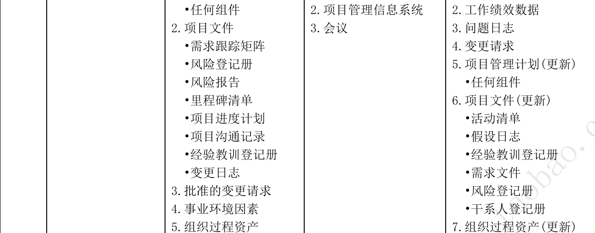
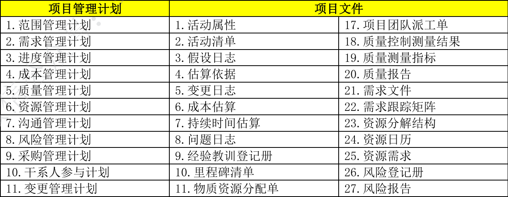
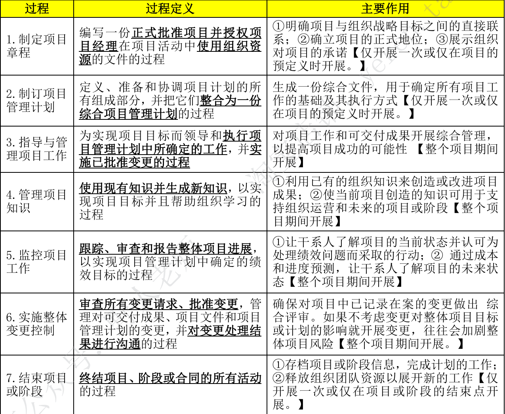
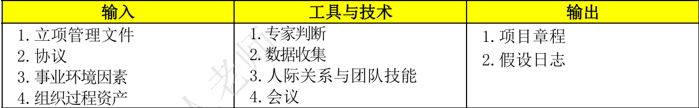
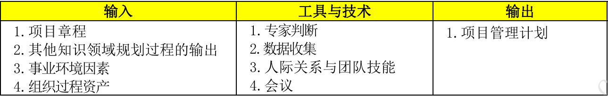
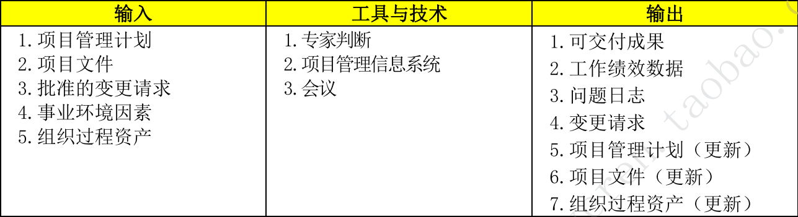
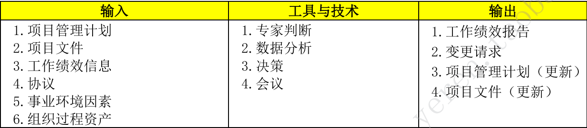
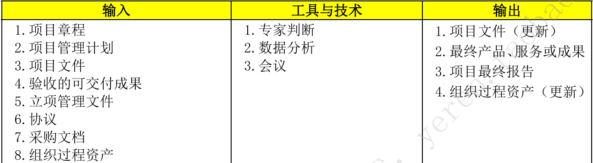
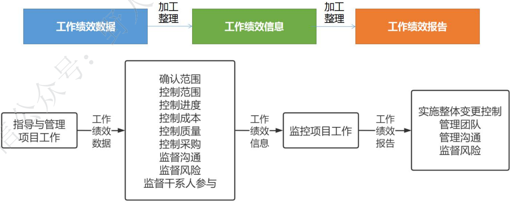

# 第8章 项目整合管理

## 8.1 管理基础

项目整合管理包括<u>识别、定义、组合、统一、协调</u>各个项目管理过程组的各个过程和项目管理活动。在项目管理中，整合管理兼具<u>统一、合并、沟通、建立联系</u>的性质，项目整合管理<u>贯穿</u>项目始终。

**项目整合管理的目标包括：**

1. 资源分配；``分配人员、实物资源等``
2. 平衡竞争性需求；``部门之间的协调。如财务部想10月份上线，开发部感觉时间紧等``
3. 研究各种备选方法；``研究项目外包还是自己做等``
4. 裁剪过程实现项目目标；
5. 管理各个项目管理知识领域之间的依赖关系；``理清楚各个环节关系，避免冲突等``

**项目整合管理ITO：**

### 8.1.1 执行整合

项目<u>整合管理由项目经理负责，项目整合管理不能被授权或转移，项目经理必须对整个项目承担最终责任</u>。

执行项目整合时项目经理承担<u>双重角色</u>：

- 组织层面上，项目经理与项目发起人携手合作，了解战略目标并确保项目目标和成果与项目组合、项目级以及业务领域保持一致。
- 项目层面上，项目经理指导团队关注重要的事务并协同工作，为此项目经理需要整合<u>过程、知识、人员</u>三个层面。
  1. <u>过程层面</u>执行整合等；``变更整合等``
  2. <u>认知层面</u>执行整合等；``整合经验、见解、领导力、技术、商业管理技能等``
  3. <u>背景层面</u>执行整合等；``考虑社交网络、多元文化、虚拟团队新技术环境等``

### 8.1.2 整合的复杂性

项目的复杂性来源于组织的<u>系统行为、人类行为、组织或环境中的不确定性</u>。在整合项目<u>之前</u>,项目经理需要考虑项目的<u>内外部环境因素</u>，检查项目的<u>特征或属性</u>。

**复杂性含义：**

1. 包含多个部分；
2. 不同部分之间存在一系列关联；
3. 不同部分之间的动态交互作用；
4. 这些交互作用所产生的行为远远大于各部分简单的相加；``例如突发性行为等``

### 8.1.3 管理新实践

与整合管理相关的新趋势和新兴实践包括：

- 使用信息化工具；``收集、分析、使用信息。如禅道app``
- 使用可视化管理工具；``直观看到项目的实时状态，促进知识转移。如甘特图、进度猫``
- 项目知识管理；``积累知识传达给目标受众，防治知识流失``
- 项目经理在项目以外的职责；``参与管理层和PMO负责的立项前、结项后的可研评估和效益管理、引导干系人参与项目``
- 混合型方法；``采用敏捷或其他迭代的适应型方法``

### 8.1.4 项目管理计划和项目文件

``记忆口诀：项目管理计划：十二计划、三和一基准、项目生命周期描述和开发方法``

## 8.2 项目整合管理过程

### 8.2.1 过程概述

#### 1. 整合管理七大过程概述（背诵）

#### 2. 五大过程组与整合管理

### 8.2.2 裁剪考虑因素

裁剪考虑：项目生命周期、开发生命周期、管理方法、知识管理、变更、治理、经验教训、效益。

### 8.2.3 敏捷与适应方法

- 采用敏捷或适应型方法可以帮助项目经理<u>决策权下放</u>，团队成员可以自行<u>决定并控制</u>产品的规划和交付。领导偏向<u>服务型</u>。
- 项目经理重点关注营造<u>合作型的决策氛围</u>，确保团队有能力应对变更。
- 促进团队成员<u>以相关领域专家的身份</u>参与整合管理。
- 如果团队成员<u>具备广泛的技能</u>而非某个狭窄的专业领域，那么这种<u>合作型方法</u>会更加有效。

## 8.3 制定项目章程

- 通过编写项目章程来<u>确认项目是否符合组织战略和日常运营的需要。</u>
- 项目章程用于<u>建立组织内部的合作关系</u>，确保正确交付合同内容。
- 项目章程中<u>授权项目经理，因此应规划前任命项目经理，越早越好，最好是制定项目章程时就任命。</u>
- 项目章程可由<u>发行人编制</u>，也可由<u>项目经理与机构合作编制。</u>
- 项目章程<u>一旦被批准就标志项目正式启动</u>。``项目章程只能由发起人签发、修订。项目经理可参与或代编制但无权签发和修订``
- 项目由<u>项目以外的机构</u>来启动，例如<u>发起人、项目集或PMO、项目组合治理委员会主席或其授权代表。</u>项目的启动者或发起人<u>应该具有一定的职权，能为项目获取资金并提供资源。</u>

**制定项目章程的ITO**

### 8.3.1 输入

#### 1. 立项管理文件

立项管理文件<u>是制定项目章程的依据。</u>一般情况下立项管理包括<u>商业需求、成本效益分析，论证项目合理性并确定项目边界。</u>``立项管理文件不是项目文件，项目经理不能修改只能提出建议。虽然是在项目之前制定，但需要定期审核``

#### 2. 协议

合同、谅解备忘录、服务水平协议（SLA）、协议书、意向书、口头协议或书面协议、为外部客户做项目签订的合同。

#### 3. 事业环境因素

影响制定项目章程过程的事业环境因素包括：

1. 政府或行业标准；
2. 法律法规要求和相关制约因素；
3. 市场条件；
4. 组织文化和氛围；
5. 组织治理框架；
6. 干系人的期望和风险临界值等。

#### 4. 组织过程资产

影响制定项目章程过程的组织过程资产主要包括：

1. 组织的标准政策、流程和程序；
2. 项目组合、项目集、项目的治理框架；
3. 监督和报告的方法；
4. 模板；
5. 历史信息与经验教训数据库等。

### 8.3.2 工具与技术

#### 1. 专家判断

是基于某应用领域、知识领域、学科、行业等的专业知识做出的判断。这些专业知识可来自具有专业学历、知识、技能、经验或培训经历的小组和个人。

#### 2. 数据收集

- 头脑风暴：大量数据、畅所欲言、追求数量、容易受权威影响。
- 焦点小组：与干系人和主题专家一起讨论，比一对一访谈有利于互动交流。``同职能、领域专家，朱慈仁引导互动式讨论``
- 访谈：与干系人直接交谈，了解高层级需求、假设条件、制约因素、审批标准。``直接交谈、预设和即兴的问题、一对一、多对多、获取机密信息``

#### 3. 人机关系与团队技能

- 冲突管理：有助于干系人就目标、成果标准、高层级需求、项目描述、总体里程碑和其他内容达成一致。
- 引导：有效引导团队活动成果达成决定、解决方案或结论。
- 会议管理：包括准备议程，确保邀请每个干系人代表，以及准备发送后续的会议纪要和行动计划。

``会议管理是必须有的，然后再会议上引导大家说出问题和提出解决方法，最终进行冲突管理大家达成一致。``

#### 4. 会议

与关键干系人举行会议。``会议管理不是会议，两者完全不同``

### 8.3.3 输出

#### 1. 项目章程（背诵）

1. 项目<u>目的</u>；

2. 可测量的<u>项目目标</u>和相关的<u>成功标准</u>；

3. 高层级<u>需求</u>、高层级项目<u>描述</u>、边界定义、<u>主要可交付成果</u>；

   ``记忆口诀：目的--目标--需求要描述``

4. 整体项目<u>风险</u>；

5. 总体里程碑<u>进度计划</u>；

6. 预先批准的<u>财务资源</u>；

7. 关键<u>干系人名单</u>；

8. 项目<u>审批要求</u>；``例如项目成功的标准、谁对成功下结论、谁签署项目结束``

   ``记忆口诀：风险--进度--资源--名单--要审批``

9. 项目<u>退出标准</u>；``例如在何种条件下能关闭或取消项目或阶段``

10. 委派的<u>项目经理及其职责和职权</u>；

11. 发起人或<u>其他批准项目章程的人员</u>的姓名和职权等；

    ``退出--两个“职权”``

#### 2. 假设日志

记录整个项目生命周期中所有的<u>假设条件</u>和<u>制约因素</u>。

## 8.4 制定项目管理计划

- 项目管理计划确定项目的<u>执行、监控、收尾方式</u>，内容会根据项目所在的应用领域和复杂程序的不同而不同。
- 项目管理计划<u>可以是概括或详细的</u>，每个部分详细程度取决去项目要求。
- 项目管理计划<u>应基准化</u>，即<u>至少规定项目的范围、时间、成本方面的基准</u>，以便考核项目执行情况和管理项目绩效。
- 在<u>确定基准之前</u>，可能要对<u>项目管理计划多次更新</u>，这些<u>更新无需遵守正式的流程</u>。但是一旦<u>确定基准，就只能提出通过变更请求，实施整体控制变更过程</u>进行更新。
- 在项目收尾之前，项目管理计划需要通过不断更新来渐进明细，并且这些更新需要得到<u>控制和批准</u>。

**制定项目管理计划ITO**

### 8.4.1 输入

#### 1. 项目章程

项目章程作为初始项目规划的起点，项目章程会根据<u>所含的信息、项目的复杂程度、已知信息的不同而不同</u>。但项目章程至少会包含<u>项目的高层级信息</u>供项目管理计划的组成部分进一步细化。

#### 2. 其他知识领域规划过程的输出

创建管理计划需要整合其他领域规划过程的输出。<u>其他知识领域规划过程所输出的子计划、基准都是本过程的输入</u>。此外，对这些子计划和基准的变更都可能导致项目管理计划的相应更新。

#### 3. 事业环境因素

影响制定项目管理计划过程的事业环境因素包括：

1. 政府或行业标准；
2. 法律法规要求和相关制约因素；
3. 垂直市场和专门领域的项目管理知识体系；
4. 组织的结构、文化、管理实践和可持续性；
5. 组织治理框架；
6. 基础设施等。

#### 4. 组织过程资产

影响制定项目管理计划过程的组织过程资产主要包括：

1. 组织的标准政策、流程和程序；
2. 项目管理计划模板；
3. 变更控制程序；
4. 监督和报告方法、风险控制程序以及沟通要求；
5. 以往类似的项目相关信息；
6. 历史信息与经验教训数据库等。

### 8.4.2 工具与技术

#### 1. 专家判断

#### 2. 数据收集

- 头脑风暴：制作项目管理计划时，经常以头脑风暴的方式收集关于项目方法的<u>创意和解决方案</u>。参会者包括<u>项目团队成员、其他主题专家和干系人</u>。
- 核对单：指导项目经理制定计划或帮助检查项目管理计划<u>是否含所需的全部信息</u>。``核对单就是checklist，检查清单``
- 焦点小组：召集干系人讨论项目管理方法和项目管理计划各个组成部分的整合方式。
- 访谈：从干系人获取特定信息，制定项目管理计划、任何子计划、项目文件。

#### 3. 人际关系与团队技能

- 冲突管理：必要时通过冲突管理让具有差异性的干系人就项目管理计划的所有方面达成共识。
- 引导：引导者确保参与者有效参与、互相理解、考虑所有意见，按既定决策流程全力支持得到的结论或结果。
- 会议管理：有必要采取会议管理确保有效召开多次会议，以便制订、统一、商定项目管理计划。

#### 4. 会议

通常利用项目<u>开工会议</u>明确项目规划阶段工作的完成并宣布开始项目执行阶段，<u>目的是传达项目目标、获得团队对项目的承诺、阐明每个干系人的角色和职责</u>。

### 8.4.3 输出

#### 1. 项目管理计划

项目管理计划是说明<u>项目执行、监控、收尾方式</u>的一份文件，它整理综合了所有知识领域子管理计划和基准，以及管理项目所需的其他组件信息，项目管理的组件取决于项目的具体需求。

**项目管理计划组件主要包括（背诵）**

1. 子管理计划：范围管理计划、需求管理计划、进度管理计划、成本管理计划、质量管理计划、资源管理计划、沟通管理计划、风险管理计划、采购管理计划、干系人参与计划。
2. 基准：范围基准、进度基准、成本基准。``这个三个基准组成绩效测量基准``
3. 其他组件：变更管理计划、配置管理计划、绩效测量基准、项目生命周期、开发方法、管理审查。

## 8.5 指导与管理项目工作

指导与管理项目工作是为<u>实现项目目标而领导和执行项目管理计划中所确定的工作，并实施已批准变更的过程。</u>本过程的主要作用是对项目工作和可交付成果开展综合管理，提高项目成功的可行性。本过程<u>需要在整个项目期间开展</u>。指导与管理项目工作的数据流向。

**指导与管理项目工作ITO**

### 8.5.1 输入

#### 1. 项目管理计划

项目管理计划的<u>任何组件</u>都可用作指导与管理项目工作的输入。

#### 2. 项目文件

- 需求跟踪矩阵：产品需求连接到相应的可交付成果，有助于项目团队聚焦最终结果。
- 风险登记册
- 风险报告
- 里程碑清单
- 项目进度计划
- 项目沟通记录
- 经验教训登记册
- 变更日志

#### 3. 批准的变更请求

- 批准的变更请求是<u>实施整体变更控制过程的输出，</u>包括项目经理审查和批准的变更请求，<u>必要时需要经变更控制委员会（CCB）</u>审查和批准。``经CCB批准的变更请求可能是纠正措施、预防措施、缺陷补救措施``

- CCB是项目的所有者权益代表，负责对变更进行决策。CCB由项目所涉及的主要干系人共同组成，通常包括<u>用户、项目所在组织管理层的决策人员。CCB是决策机构，不是作业机构</u>；通常CCB的工作是通过评审手段来决定项目基准是否需要变更，但<u>不提出变更方案。</u>

#### 4. 事业环境因素

影响指导与管理工作过程的事业环境因素包括：

1. 组织的结构、文化、管理实践和可持续性；
2. 基础设施；
3. 干系人的风险临界值；

#### 5. 组织过程资产

影响管理与指导工作过程的组织过程资产包括：

1. 组织的标准政策、流程和程序；
2. 问题与缺陷管理程序；
3. 问题与缺陷管理数据库；
4. 绩效测量数据库；
5. 变更控制和风险控制程序；
6. 以往项目的项目信息等。

### 8.5.2 工具与技术

#### 1. 专家判断

#### 2. 项目管理信息系统

项目管理信息系统给项目提供了IT软件工具，例如<u>进度计划软件工具、工作授权系统、配置管理系统、信息收集与发布系统、进入其他在线信息系统的登录界面、支持自动收集、报告关键绩效指标。</u>

#### 3. 会议

参会者<u>项目经理、项目团队成员、受影响的干系人</u>。会议类型包括<u>开工会议、技术会议、敏捷或迭代规划会议、每日站会、指导小组会议、问题解决会议、进展跟班会议、回顾会议</u>。

### 8.5.3 输出

#### 1. 可交付成果

可交付成果是<u>某一过程、阶段、项目完成时</u>，必须产出的任何独特并<u>可核实</u>的<u>产品、成果、服务能力</u>。它通常是项目的结果包括项目管理计划的组成部分。

#### 2. 工作绩效数据

工作绩效数据是子在执行项目的过程中从每个正在执行的活动中收集到的<u>原始观察结果和测量值</u>。例如工作绩效数据、已完成的工作、关键绩效指标KPI、技术绩效测量结果、进度、活动的开始日期和结束日期、已完成的故事点、可交付成果状态、进度进展情况、变更请求的数量、缺陷的数量、实际发生的成本、实际持续时间等。

#### 3. 问题日志

在整个项目生命周期中，项目经理通常会遇到<u>问题、差距、不一致、意外冲突。问题日志是一种记录和跟进所有问题的项目文件</u>，内容通常包括：

1. 问题类型；
2. 问题提出者和提出时间；
3. 问题描述；
4. 问题优先级；
5. 解决问题负责人；
6. 目标解决日期；
7. 问题状态；
8. 最终解决情况等

#### 4. 变更情况

变更请求是关于任何修改文件、可交付成果或基准的正式提议。<u>任何项目干系人</u>都可提出变更请求。

变更请求一般包括：

- 纠正措施：使项目工作绩效重新与<u>项目管理计划一致</u>。
- 预防措施：确保项目工作<u>未来绩效符合项目管理计划</u>。
- 缺陷补救：<u>修正不一致</u>产品或产品组件。
- 更新：对正式受控的的项目文件或计划进行变更，<u>以反映修改、增加的意见或内容</u>。

#### 5. 项目管理计划

#### 6. 项目文件

在指导与管理项目工作过程中更新的项目文件：

- 活动清单；
- 假设日志；
- 经验教训登记册；
- 需求文件；
- 风险登记册；
- 干系人登记册；

#### 7. 组织过程资产

## 8.6 管理项目知识

管理项目知识是<u>利用现有知识生成新知识</u>实现项目目标并帮助组织学习的过程。

**管理项目知识ITO**

### 8.6.1 输入

#### 1. 项目管理计划

#### 2. 项目文件

可作为管理项目知识输入的项目文件：

- 资源分解结构：包含团队组成的信息，有助于了解团队拥有的和缺乏的知识。
- 项目团队派工单：说明项目已经具有的能力和经验以及可能缺乏的知识。
- 供方选择标准：选择供方的标准，有助于了解供方拥有的知识。
- 干系人登记册

#### 3. 可交付成果

#### 4. 事业环境因素

#### 5. 组织过程资产

### 8.6.2 工具与技术

#### 1. 专家判断

#### 2. 知识管理

知识管理工具和技术主要包括：``强调人和人联系在一起，隐性知识``

1. 人际交往
2. 实践社区和特别兴趣小组
3. 会议
4. 工作跟随和跟随指导
5. 讨论论坛
6. 知识分享活动
7. 研讨会
8. 讲故事
9. 创造力和创意管理技术
10. 知识展会和茶座
11. 交互式培训等

<u>面对面有利于建立信任关系，建立后可以用虚拟互动来维护信任关系</u>。

#### 3. 信息管理

信息管理用于创建人们与知识之间的联系，可以有效促进<u>简单、明确的显性知识</u>分享。``人和知识联系在一起，显性知识好记录``

#### 4. 人际关系与团队技能

- 积极倾听：有助于减少误解促进沟通和知识分享。
- 引导：有助于有效指引团队成果达成决定、解决方案、结论。
- 领导力：可帮助沟通愿景并鼓舞项目团队关注合适的知识和知识目标。
- 人际交往：促进项目干系人之间建立非正式的联系和关系，为显性和隐形知识的分享创造条件。
- 大局观：有助于项目经理根据组织政策与职权结构等进行规划与沟通。

### 8.6.3 输出

#### 1. 经验教训手册

经验教训手册包含<u>执行情况的类别和详细的描述</u>，包括与执行情况相关的<u>影响、建议、行动方案</u>，可以记录<u>遇到的挑战、问题、意识到的风险和机会</u>。

在项目的<u>早期创建</u>，作为管理项目知识的输出。在整个项目期间可以作为很多过程的输入，也可以作为输出而<u>不断更新</u>。在项目或阶段<u>结束时</u>，把相关的信息<u>归入经验教训知识库</u>，作为<u>组织过程资产的一部分</u>。

#### 2. 项目管理计划

#### 3. 组织过程资产

## 8.7 监控项目工作

监督是<u>管穿</u>整个项目的项目管理活动之一，包括<u>收集、测量、分析测量结果</u>，以及预测趋势以便推动过程改进。

**监控项目工作过程主要关注：**

1. 把项目的<u>实际绩效与项目管理计划进行比较</u>；
2. 定期<u>评估项目绩效</u>，决定是否需要采取纠正或预防措施，并<u>推荐必要的措施</u>；
3. 检查<u>单个项目风险的状态</u>；
4. 整个项目期间，<u>维护一个准确且及时更新的信息库</u>来反应产品及文件的情况；
5. 为状态报告、进展测量、预测<u>提供信息</u>；
6. <u>做出预测</u>，更新当前的成本与进度信息；
7. <u>监督已批准变更的实施情况</u>；
8. 如果项目是项目集的一部分，还应向项目集<u>管理层报告项目进展和状态</u>；
9. 确保<u>项目与商业需求保持一致</u>等。

**监督项目工作ITO**

### 8.7.1 输入

#### 1. 项目管理计划

#### 2. 项目文件

#### 3. 工作绩效信息

#### 4. 协议

#### 5. 事业环境因素

#### 6. 组织过程资产

### 8.7.2 工具与技术

#### 1. 专家判断

#### 2. 数据分析

- 备选方案分析：出现偏差时选择要执行的纠正措施或纠正措施和预防措施的组合；
- 成本效益分析：出现偏差时确定最节约成本的纠正措施；
- 挣值分析：对范围、进度、成本绩效进行的综合分析；``计算已经发生偏差的情况``
- 根本原因分析：关注识别问题的根本原因，识别出现偏差的原因以及项目经理为达成项目目标应关注的重点领域；
- 趋势分析：根据以往结果预测未来绩效，根据结果提出必要的预防措施建议；
- 偏差分析：审查目标绩效与实际绩效之间的差异，可涉及持续时间估算，可在每个知识领域针对特定变量开展偏差分析；``分析发生偏差的严重程度``

``按照含义的流程：挣值分析--偏差分析--根本原因分析--趋势分析--备选方案分析--成本效益分析``

#### 3. 决策

投票方法包括：一致同意、大多数同意、相对多数原则。``还有独裁方法，一致同意票数100%、大多数同意票数有一个突破50%、相对多数原则是没有一个突破50%``

#### 4. 会议

### 8.7.3 输出

#### 1. 工作绩效报告

基于<u>工作绩效信息</u>以实体或电子方式编制工作绩效报告来制定决策或采取行动。根据项目沟通管理计划，通过沟通过程向<u>项目干系人发送工作绩效报告</u>。

#### 2. 变更请求

#### 3. 项目管理计划

#### 4. 项目文件

## 8.8 实施整体变更控制

实施整体变更控制<u>贯穿项目始终，项目经理对此承担最终责任</u>。变更请求可能影响<u>项目范围、产品范围、任一项项目管理计划组件、任一项项目文件</u>。整个项目生命周期任何时间，参与项目的<u>任何干系人都可以提出变更请求</u>。

基准确定之前，变更无需正式受控。<u>一旦确定基准，必须通过实施整体变更控制</u>过程来处理变更请求。变更可以<u>口头提出</u>，但所有变更请求<u>必须以书面形式记录</u>，并纳入变更管理和配置管理系统。

批准变更之前，可能需要了解<u>变更对进度、成本的影响</u>。每项记录在案的变更请求都<u>必须由一位责任人批准、推迟、否决，责任人通常是项目发起人或项目经理，必要时由CCB来实施整体变更控制过程</u>。

**实施整体变更控制ITO**

### 8.8.1 输入

#### 1. 项目管理计划

#### 2. 项目文件

#### 3. 工作绩效报告

#### 4. 变更请求

- 变更请求包含<u>纠正措施、预防措施、缺陷补救</u>，以及针对正式受控的项目文件或可交付成果的更新。<u>变更可能影响或不影响项目基准</u>，变更决定通常由项目经理做决策。
- 对于会影响的变更，在请求中<u>说明执行变更的成本、所需的计划日期修改、资源需求、相关风险。这种变更由CCB和客户或发起人审批</u>。

#### 5. 事业环境因素

#### 6. 组织过程资产

### 8.8.2 工具与技术

#### 1. 专家判断

#### 2. 变更控制工具

为了便于开展配置和变更管理，<u>可以使用一些手动或信息化的工具</u>。

配置控制和变更控制关注点不同：配置控制<u>重点关注可交付成果及各个过程的技术规范</u>；变更控制<u>重点关注识别、记录、批准、否决对项目文件、可交付成果或基准的变更</u>。

变更控制工具需要支持的配置管理活动包括：

- 识别配置项：识别与选择配置项。为定义与核实产品配置、标记产品和文件、管理变更、明确责任提供基础。
- 记录并报告配置项状态：对各个配置项的信息进行记录和报告。
- 进行配置项核实与审计：通过配置核实与审计，确保项目的配置项组成的正确性及相应的变更都被登记、评估、审批、跟踪、正确实施，确保配置文件所规定的功能要求都已实现。

变更控制工具需要支持的变更管理活动包括：

- 识别变更：识别并选择过程或项目文件的变更项。
- 记录变更：将变更记录为合适的变更请求。
- 做出变更决定：审查变更，批准、否决、推迟对项目文件、可交付成果、基准的变更或做出其他决定。
- 跟踪变更：确定变更被登记、评估、批准、跟踪，并向干系人传达最终结果。

**变更程序（背诵）**

1. 变更申请
2. 对变更的初审
3. 变更方案论证
4. 变更审查
5. 发出通知并实施
6. 实施监控
7. 效果评估
8. 变更收尾

#### 3. 数据分析

- 备选方案分析：评估变更请求并确定哪些请求可接受、应否决或需修改。
- 成本效益分析：确定变更请求是否值得投入相关的成本。

#### 4. 决策

- 投票：采取一致同意、大多数同意、相对多数原则三个方法。
- 独裁型决策制定：有一个人负责为整个集体制定决策。
- 多标准决策分析：借助决策矩阵，根据一系列预定义的准则，用系统分析方法评估变更请求。``多维度考虑``

#### 5. 会议

### 8.8.3 输出

#### 1. 批准的变更请求

由项目经理、CCB、指定的团队成员，根据变更管理计划处理变更请求，做出批准、推迟、否决的决定。

#### 2. 项目管理计划

#### 3. 项目文件

变更日志：将项目期间发生的变更全部记录在变更日志中。``所有的变更，批准、拒绝、推迟``

## 8.9 结束项目或阶段

**结束项目或阶段的主要作用：**

1. 存档项目或阶段信息；
2. 释放组织团队资源；

**结束项目阶段或阶段过程所需执行的活动包括：**

- <u>达到阶段或项目的完工或退出标准</u>所必须开展的行动和活动；
- <u>关闭项目合同协议或项目阶段合同协议</u>所必须开展的活动；
- 为完成<u>收集或阶段记录、审计项目成败、管理知识分享和传递、总结经验教训、存档项目信息</u>供组织未来使用等所必须开展的活动；
- 为向下一个阶段，或者向生产和运营部分<u>移交项目的产品、服务或成果</u>所必须开展的行动和活动；
- <u>收集关于改进或更新组织政策和程序的建议</u>，并发送给相应的组织部分；
- <u>测量干系人的满意程度</u>等；

如果项目<u>提前终止</u>，结束项目或阶段过程还需要指定程序<u>调查和记录提前终止的原因</u>。

**结束项目或阶段ITO**

### 8.9.1 输入

#### 1. 项目章程

#### 2. 项目管理计划

#### 3. 项目文件

#### 4. 验收的可交付成果

包括批准的产品规范、交货收据、工作绩效文件。

#### 5. 立项管理文件

#### 6. 协议

#### 7. 采购文档

#### 8. 组织过程资产

### 8.9.2 工具与技术

#### 1. 专家判断

#### 2. 数据分析

- 文件分析：评估现有文件总结经验教训和分享知识改进未来项目和组织资产。
- 回归分析：作用于项目结果的不同变量之间的相互关系，提高未来的项目绩效。
- 趋势分析：确认组织所用模式的有效性，为未来项目进行相应的模式调整。
- 偏差分析：比较计划目标于最终结果来改进组织的测量指标。

#### 3. 会议

用于确定可交付成果已通过验收，达到退出标准，正式关闭合同，评估干系人满意度，收集经验教训，传递项目知识和信息庆祝成功。

- 参会者：项目团队成员、参与项目或受项目影响的干系人。
- 会议类型：收尾报告会、客户总结会、经验教训总结会、庆祝会等。

### 8.9.3 输出

#### 1. 项目文件

#### 2. 最终产品、服务、成果

#### 3. 项目最终报告

#### 4. 组织过程资产

## 补充

### 1. 可交付成果的变化过程

### 2. 变更请求的变化过程

1. 指导和管理项目执行过程得到（可交付成果）
2. 通过质量控制过程检查质量是否符合（核实的可交付成果）
3. 再与需求文件对比是否符合产品范围：符合（验收的可交付成果）不符合（提交变更请求）
4. 通过变更控制（批准的变更请求）
5. 再进行第一条指导和管理项目执行过程得到（可交付成果）
6. 在进行第二条质量控制确认得到（确认的变更）

### 3. 三种绩效的变化过程

> 注意：监督风险的输入同时有绩效数据和绩效报告

