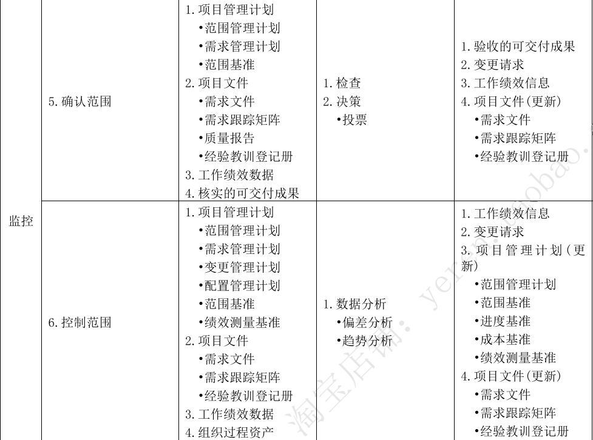
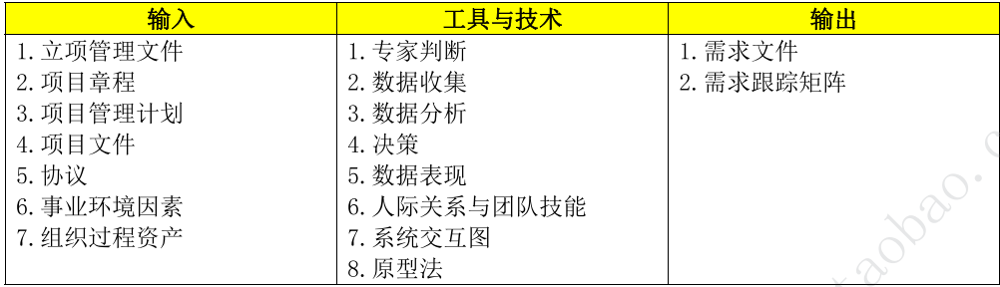

# 第9章 项目范围管理 

## 9.1 管理基础

**范围管理ITO**

### 9.1.1  产品范围与项目范围

在项目环境中，“范围”有两种含义：

- 产品范围：指某项产品、服务、成果所具有的特征和功能。产品范围的完成情况是根据<u>产品需求</u>来衡量的。
- 项目范围：<u>包括产品范围</u>，是为交付具有规定特性与功能的产品服务或成果而必须完成的工作。项目范围的完成情况是根据<u>项目管理计划</u>来衡量的。

### 9.1.2 管理新实践

需求一直是项目管理的关注重点，需求管理过程结束于需求关闭。

商业分析师包括需求管理相关的活动，项目经理确保这些活动列入项目管理计划在预算内按时完成并创造价值。

<u>项目经理与商业分析师之间应该是伙伴式合作关系。</u>

## 9.2 项目范围管理过程

### 9.2.1 项目范围概览

#### 1. 范围管理六大过程概述

#### 2. 五大过程组与范围管理

### 9.2.2 裁剪因素考虑

裁剪考虑：知识和需求管理、确认和控制、开发方法、需求的稳定性、治理

### 9.2.3 敏捷与适应方法

敏捷或适应型方法<u>特意在项目早期缩短定义和协商范围的时间，</u>为后续细化范围、明确范围争取更多时间。在许多情况下不断涌现的需求差异性会可能较大，<u>所以敏捷方法有目的构建和审查原型，通过多次发布版本明确需求，范围会在整个项目期间定义再定义。</u>

采用敏捷或适应型生命周期，旨在<u>应对大量变更，需要干系人持续参与项目。</u>所以适应型项目的整体范围分解为一系列拟实现的需求和拟定义的工作（又名产品未完成项），通过多次迭代来开发可交付成果，<u>在每次迭代开始时定义和批准详细的范围。</u>在一个迭代开始时，团队努力确定产品未完成项中哪些优先级较高的未完成项需要在下一次迭代中交付。<u>在每次迭代中，都会重复开展三个过程：①收集需求；②定义范围；③创建WBS。</u>

在适应型或敏捷性生命周期中，<u>发起人和客户代表应该持续参与项目，并对迭代交付的可交付成果提供反馈意见，</u>确保产品未完成项真是的反应了他们的当前需求。<u>在每次迭代中，都会重复开展两个过程：①确认范围；②控制范围。</u>

## 9.3 规划范围管理

规划范围管理是为了记录如何定义、确认、控制项目范围及产品范围而创建范围管理计划的过程。作用是在整个项目期间对如何管理范围提供指南和方向。本过程仅开展一次或仅在项目的预定义点开展。

**规划范围的ITO**

### 9.3.1 输入

#### 1. 项目章程

#### 2. 项目管理计划

#### 3. 事业环境因素

#### 4. 组织过程资产

### 9.3.2 工具与技术

#### 1. 专家判断

#### 2. 数据分析

适用于本过程的数据分析技术是<u>备选方案分析。</u>备选方案分析技术用于评估、收集需求，详述项目和产品范围，创造产品，确认范围和控制范围的各种方法。

#### 3. 会议

### 9.3.3 输出

#### 1. 范围管理计划

范围管理计划是项目管理计划的组成部分，描述将<u>如何定义、制定、监督、控制和确认项目范围。</u>

包括：

​	①如何规划项目范围说明书；

​	②根据详细项目范围说明书创建WBS；

​	③确定如何审批和维护范围基准；

​	④正式验收已完成的项目可交付成果；``可以是正式的或非正式的，非常详细的或高度概括的``

#### 2. 需求管理计划

需求管理计划是项目管理计划的组成部分，描述<u>如何分析、记录、和管理需求。</u>

包括：

​	①如何规划、跟踪、报告各种需求活动；

​	②配置管理活动，例如：如何启动变更、如何分析影响、如何进行追溯并跟踪和报告、变更审批权限；

​	③需求优先级排序过程；

​	④测量指标及使用这些指标的理由；

​	⑤反应哪些需求属性将被列入跟踪矩阵等。

## 9.4 收集需求

本过程<u>主要是为定义产品范围和项目范围奠定基础。</u>本过程仅开展一次或仅在项目的预定义点开展。

需求是根据<u>特定协议或其他强制性规范，产品、服务或成果必须具备的条件或能力。</u>它包括<u>发起人、客户、其他干系人的已量化且书面记录的需要和期望。</u>应该足够详细地挖掘、分析、记录这些需求，并将其包含在范围基准中，在项目执行开始后对其进行测量。<u>需求将作为后续工作分解结构WBS的基础，也将作为成本、进度、质量、采购规划的基础。</u>

**收集需求的ITO：**

### 9.4.1 输入

#### 1. 立项管理文件

#### 2.项目章程

#### 3. 项目管理计划

#### 4. 项目文件

#### 5. 协议

#### 6. 事业环境因素

#### 7. 组织过程资产

### 9.4.2 工具与技术

#### 1. 专家判断

#### 2. 数据收集

- 头脑风暴：用来产生和收集对项目需求与产品需求<u>多种创意的技术。</u>
- 访谈：获取信息的<u>正式或非正式的方法</u>；可以<u>一对一、多对多</u>。访谈有经验的项目参与者、发起人、其他高管及主题专家，有助于识别和定义所需产品可交付成果的特征和功能。<u>访谈也可用于获取机密信息。</u>
- 问卷调查：设计一系列<u>书面问题，向众多受访者快速收集信息。</u>非常适用于<u>受众多样化。</u>需要快速完成调查，受访者<u>地理位置分散</u>并且适合开展统计分析的情况。
- 标杆对照：将<u>实际或计划</u>的产品、过程和实践，<u>与其他可比较组织的实践进行比较，以便识别最佳实践，形成改进意见，并为绩效考核提供依据。</u>标杆对照采用的可比组织<u>可以是内部的，也可以是外部的。</u>

#### 3. 数据分析

文件分析指审核和评估任何相关的文件信息。

#### 4. 决策

- 投票：一种为达成某种期望结果，而对未来多个行动方案进行评估的决策技术和过程。<u>用于生成、归类、排序产品需求。</u>
- 独裁型决策制定：由一个人负责为整个集体制定决策。
- 多标准决策分析：借助<u>决策矩阵，</u>用系统分析方法建立诸如风险水平、不确定性和价值收益等<u>多重标准，</u>以对众多创意进行<u>评估和排序。</u>``比如需求的紧急性、难易度、成本效益化多个角度占用的权重来决定``

#### 5.数据表现

- 亲和图：用来对大量<u>创意进行分组</u>的技术，以便进一步审查和分析。``每一个选择都有分类的类组``
- 思维导图：把从头脑风暴中获得的创意整合成一张图，用以<u>反映创意之间的共性与差异，激发新创意。</u>

#### 6. 人际关系与团队技能

- 名义小组技术：用于促进头脑风暴的一种技术，通过<u>投票排列</u>最有用的创意，以便进一步开展头脑风暴或优先排序。
- 观察和交谈：<u>直接察看</u>个人在各自的环境中如何执行工作和实施流程，当产品使用者<u>难以或不愿说清他们的需求时</u>，特别需要通过观察来了解他们的工作细节。观察也称<u>工作跟随</u>，通常由旁站观察者观察业务专家如何执行工作，但也可参与观察者来观察，通过实际参与一个流程或程序，体验流程或程序如何实施，<u>以便挖掘隐藏的需求。</u>
- 引导：引导与主题研讨会结合适用，把主要干系人召集在一起定义产品需求。研讨会用于快速<u>定义跨职能需求并协调干系人的需求差异。</u>

#### 7. 系统交互图

对产品范围的<u>可视化描绘</u>可以直观的显示业务系统（过程、设备、计算机系统等）及其与人和其他系统之间的交互方式。

#### 8. 原型法

原型法指在实际制造预期产品之前，先造出产品的模型，<u>并据此特征对需求的早期反馈</u>。原型包括微缩产品、计算机生成的二维和三维模型、实体模型或模拟。<u>原型法支持渐进明细的理念。故事板</u>是一种原型技术，通过一系列的图像或图示来展示顺序或导航路径。

### 9.4.3 输出

#### 1. 需求文件

需求文件描述各种单一需求将如何满足项目相关的业务需求（高层级需求）。一开始可能只有高层级需求，随着有关需求信息的增加而逐步细化。

只有<u>明确的（可测量和可测试的）、可跟踪的、完整的、相互协调的且主要干系人认可的需求才能作为基准。</u>

需求文件格式多种多样，既可以是一份按干系人和<u>优先级分类列出全部需求的简单文件，</u>也可以是一份包括内容提要、细节描述和附件等的<u>详细文件。</u>

**需求的类别一般包括：**

​	（1）业务需求：整个组织的高层级需要，例如解决业务问题或抓住业务机会以实施项目的原因。

​	（2）干系人需求：干系人的需要。

​	（3）解决方案需求：<u>为满足业务需求和干系人需求，产品、服务、成果必须具备的特性、功能、特征</u>。解决方案需求又进一步分为<u>功能需求和非功能需求</u>：①功能需求：描述产品应具备的功能，例如产品应该执行的行动、流程、数据和交互；②非功能需求：是对功能需求的补充，是产品正常运行所需的环境条件或质量要求，例如可靠性、保密性、性能、安全性、服务水平、可支持性、保留或清除等。

​	（4）过渡和就绪需求：如数据转换和培训需求。这些需求描述了从当前状态过渡到将来状态所需的临时能力。

​	（5）项目需求：项目需要满足的行动、过程或其他条件，例如里程碑日期、合同责任、制约因素等。

​	（6）质量需求：<u>用于确认项目可交付成果的成果完成</u>或其他项目需求的实现的任何条件或标准，例如测试、认证、确认等。

